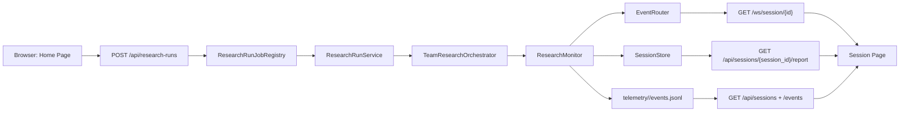

# Dashboard Guide

This document is the comprehensive reference for the CC Deep Research dashboard: what it is, how to start it, how to use each screen, and how the full browser-first monitoring stack works under the hood.

## What The Dashboard Is

The dashboard is a two-part monitoring interface for CC Deep Research:

- a FastAPI backend in [`src/cc_deep_research/web_server.py`](../src/cc_deep_research/web_server.py)
- a Next.js frontend in [`dashboard/`](../dashboard)

Its job is to let you:

- start research runs from the browser
- list recent sessions
- watch live telemetry over WebSocket while a run is active
- inspect workflow phases, agent activity, tool calls, and LLM routing
- view the final rendered report for completed runs

It is separate from the older Streamlit telemetry dashboard in [`src/cc_deep_research/dashboard_app.py`](../src/cc_deep_research/dashboard_app.py). The browser dashboard is the interactive operational UI. The Streamlit dashboard is the historical analytics UI.

## Who This Guide Is For

- operators who want to run research and monitor it visually
- developers working on the dashboard frontend or FastAPI backend
- contributors trying to understand the runtime contracts between telemetry, jobs, and UI state

## High-Level Architecture

At runtime, the dashboard combines three data paths:

1. browser request path
   The user starts a run from the home page form.
2. live telemetry path
   The monitor persists events and can publish them through the in-memory event router to subscribed WebSocket clients.
3. historical read path
   The backend reads saved session state and telemetry files so the UI can load older runs.



## Main Components

### Backend

- app factory and routes: [`src/cc_deep_research/web_server.py`](../src/cc_deep_research/web_server.py)
- live pub/sub router: [`src/cc_deep_research/event_router.py`](../src/cc_deep_research/event_router.py)
- run execution service: [`src/cc_deep_research/research_runs/service.py`](../src/cc_deep_research/research_runs/service.py)
- in-process run registry: [`src/cc_deep_research/research_runs/jobs.py`](../src/cc_deep_research/research_runs/jobs.py)
- telemetry persistence and emission: [`src/cc_deep_research/monitoring.py`](../src/cc_deep_research/monitoring.py)

### Frontend

- home page: [`dashboard/src/app/page.tsx`](../dashboard/src/app/page.tsx)
- content studio home: [`dashboard/src/app/content-gen/page.tsx`](../dashboard/src/app/content-gen/page.tsx)
- content studio pipeline detail: [`dashboard/src/app/content-gen/pipeline/[id]/page.tsx`](../dashboard/src/app/content-gen/pipeline/[id]/page.tsx)
- session page: [`dashboard/src/app/session/[id]/page.tsx`](../dashboard/src/app/session/[id]/page.tsx)
- form to launch research: [`dashboard/src/components/start-research-form.tsx`](../dashboard/src/components/start-research-form.tsx)
- content studio forms: [`dashboard/src/components/content-gen/start-pipeline-form.tsx`](../dashboard/src/components/content-gen/start-pipeline-form.tsx), [`dashboard/src/components/content-gen/quick-script-form.tsx`](../dashboard/src/components/content-gen/quick-script-form.tsx), [`dashboard/src/components/content-gen/strategy-editor.tsx`](../dashboard/src/components/content-gen/strategy-editor.tsx)
- recent sessions list: [`dashboard/src/components/session-list.tsx`](../dashboard/src/components/session-list.tsx)
- session detail surface: [`dashboard/src/components/session-details.tsx`](../dashboard/src/components/session-details.tsx)
- report viewer: [`dashboard/src/components/session-report.tsx`](../dashboard/src/components/session-report.tsx)
- run status poller: [`dashboard/src/components/run-status-summary.tsx`](../dashboard/src/components/run-status-summary.tsx)
- dashboard store: [`dashboard/src/hooks/useDashboard.ts`](../dashboard/src/hooks/useDashboard.ts)
- REST client: [`dashboard/src/lib/api.ts`](../dashboard/src/lib/api.ts)
- WebSocket client: [`dashboard/src/lib/websocket.ts`](../dashboard/src/lib/websocket.ts)
- event normalization and derived view models: [`dashboard/src/lib/telemetry-transformers.ts`](../dashboard/src/lib/telemetry-transformers.ts)
- pipeline stage panels: [`dashboard/src/components/content-gen/stage-panels/*.tsx`](../dashboard/src/components/content-gen/stage-panels/)
- stage trace summary: [`dashboard/src/components/content-gen/stage-trace-summary.tsx`](../dashboard/src/components/content-gen/stage-trace-summary.tsx)
- stage result panel: [`dashboard/src/components/content-gen/stage-result-panel.tsx`](../dashboard/src/components/content-gen/stage-result-panel.tsx)
- pipeline progress tracker: [`dashboard/src/components/content-gen/pipeline-progress-tracker.tsx`](../dashboard/src/components/content-gen/pipeline-progress-tracker.tsx)

## How To Start The Dashboard

### Recommended Development Startup

From the repository root:

```bash
./scripts/dashboard-dev
```

This launches:

- FastAPI backend via `uvicorn`
- Next.js frontend dev server

The launcher is a thin shell wrapper around [`dashboard/scripts/dev.mjs`](../dashboard/scripts/dev.mjs), which:

- finds open ports starting from `8000` for the backend and `3000` for the frontend
- starts both processes
- prefixes logs by process
- shuts both down together on `Ctrl+C`

Current caveat:

- the launcher can move the backend off `8000`, but the frontend runtime config only reads `NEXT_PUBLIC_CC_*` variables from [`dashboard/src/lib/runtime-config.ts`](../dashboard/src/lib/runtime-config.ts)
- the launcher currently exports `NEXT_PUBLIC_API_BASE_URL`, which the runtime config does not read
- if the backend falls back to a non-`8000` port, set `NEXT_PUBLIC_CC_BACKEND_ORIGIN` manually before starting the frontend or use fixed ports

### Equivalent Manual Startup

Backend:

```bash
uv run uvicorn cc_deep_research.web_server:create_app --factory --host 0.0.0.0 --port 8000 --reload
```

Frontend:

```bash
cd dashboard
npm install
npm run dev:frontend
```

### Backend-Only CLI Startup

If you want only the API/WebSocket server:

```bash
uv run cc-deep-research dashboard --host localhost --port 8000
```

That command is registered in [`src/cc_deep_research/cli/dashboard.py`](../src/cc_deep_research/cli/dashboard.py).

### Frontend Runtime Configuration

The frontend derives its runtime targets from [`dashboard/src/lib/runtime-config.ts`](../dashboard/src/lib/runtime-config.ts).

Supported environment variables:

```bash
NEXT_PUBLIC_CC_BACKEND_ORIGIN=http://localhost:8000
NEXT_PUBLIC_CC_API_BASE_URL=http://localhost:8000/api
NEXT_PUBLIC_CC_WS_BASE_URL=ws://localhost:8000/ws
```

Defaults:

- backend origin: `http://localhost:8000`
- API base: `${backendOrigin}/api`
- WebSocket base: `ws://localhost:8000/ws` or `wss://...` if the backend origin is HTTPS

## How To Use The Dashboard

### Home Page

The home page in [`dashboard/src/app/page.tsx`](../dashboard/src/app/page.tsx) does two things:

- renders the launch console on the right with preset-driven research start controls
- loads recent sessions on first mount and renders triaged session groups beneath the control-room summary
- links to the dedicated settings page at `/settings`

### Settings Page

The settings page in [`dashboard/src/app/settings/page.tsx`](../dashboard/src/app/settings/page.tsx) is the operator surface for editing persisted application config.

It combines:

- the sectioned settings editor in [`dashboard/src/components/config-editor.tsx`](../dashboard/src/components/config-editor.tsx)
- masked secret controls in [`dashboard/src/components/config-secrets-panel.tsx`](../dashboard/src/components/config-secrets-panel.tsx)
- search-cache controls in [`dashboard/src/components/search-cache-panel.tsx`](../dashboard/src/components/search-cache-panel.tsx)

The editor is organized around operator concerns instead of backend structure:

- research defaults
- execution and output
- model routing
- secrets
- runtime override status

The config API returns both persisted and effective values:

- `persisted_config` is what is saved to YAML
- `effective_config` is what the backend is currently using after environment-variable overrides
- `overridden_fields` lists the fields where runtime env vars still win

This matters operationally because saving config does not mutate in-flight runs and does not override active environment variables. The UI makes overridden fields read-only and shows both saved and runtime values side by side.

The settings UI now makes that impact explicit in three places:

- each editable field calls out that saves affect future runs only
- each overridden field explains why it is read-only and which env var is currently winning
- the save/reset panel states exactly what reset clears and what save persists

Secret handling uses the same saved-versus-runtime framing as normal settings:

- secrets are never returned in plain text
- the UI shows saved presence, runtime presence, and override state instead of echoing values
- operators can explicitly replace or clear persisted secrets
- clearing a secret requires confirmation

All settings saves apply to future runs. Active runs keep the config that was resolved when they started.

### Content Studio

The content-studio workspace in [`dashboard/src/app/content-gen/page.tsx`](../dashboard/src/app/content-gen/page.tsx) now shares the same primitive layer as the rest of the dashboard for:

- pipeline launch inputs
- quick-script run controls and markdown transfer
- strategy editing fields
- publish-queue tables
- expandable script history rows
- expandable pipeline stage result panels

The shared content-studio primitive set currently lives under [`dashboard/src/components/ui/`](../dashboard/src/components/ui/) and includes:

- `input.tsx`
- `textarea.tsx`
- `label.tsx`
- `form-field.tsx`
- `native-select.tsx`
- `alert.tsx`
- `table.tsx`
- `collapsible-panel.tsx`

The migration is intentionally not forcing every visualization into generic primitives. These surfaces remain custom by design:

- [`dashboard/src/components/workflow-graph.tsx`](../dashboard/src/components/workflow-graph.tsx)
- [`dashboard/src/components/decision-graph.tsx`](../dashboard/src/components/decision-graph.tsx)
- [`dashboard/src/components/agent-timeline.tsx`](../dashboard/src/components/agent-timeline.tsx)
- [`dashboard/src/components/content-gen/pipeline-progress-tracker.tsx`](../dashboard/src/components/content-gen/pipeline-progress-tracker.tsx)
- [`dashboard/src/components/content-gen/script-viewer.tsx`](../dashboard/src/components/content-gen/script-viewer.tsx)

After the content-studio migration, the remaining raw form controls are concentrated in older research, settings, and session-management surfaces:

- [`dashboard/src/components/start-research-form.tsx`](../dashboard/src/components/start-research-form.tsx)
- [`dashboard/src/components/config-editor.tsx`](../dashboard/src/components/config-editor.tsx)
- [`dashboard/src/components/config-secrets-panel.tsx`](../dashboard/src/components/config-secrets-panel.tsx)
- [`dashboard/src/components/session-list.tsx`](../dashboard/src/components/session-list.tsx)

### Pipeline Detail Page

The pipeline detail page at `/content-gen/pipeline/[id]` provides a comprehensive view of a content-generation pipeline's execution:

**Main Components:**

- Pipeline header with theme, iteration badge, and stop control
- Stage status badges showing completed/skipped/failed counts and warnings
- Sidebar progress tracker showing all 13 pipeline stages
- Expandable stage result panels with trace summaries and stage outputs

**Stage Trace Summary:**

Each stage displays rich metadata from the trace:

- Status badge (completed/skip/failed)
- Duration in human-readable format
- Warning count and degradation indicators
- Selected idea/angle identifiers
- Metadata pills showing counts and flags (Ideas, Angles, Facts, Proofs, Cached, Steps, LLM calls, Words, Beats, Platforms, Iteration, Score, rerun-research)
- Decision summary explaining the stage's reasoning
- Input/output summaries
- Warnings and degradation reasons

**Stage Output Panels:**

The page renders detailed output panels for each pipeline stage:

- **Load Strategy**: Strategy memory configuration
- **Plan Opportunity**: Opportunity brief with goal, audience, problem statements
- **Build Backlog**: All backlog items with category, score, risk level, audience, why-now, and evidence
- **Score Ideas**: Scored ideas with breakdown by dimension (relevance, novelty, authority fit, etc.), total scores, and recommendations
- **Generate Angles**: Angle options with target audience, core promise, primary takeaway
- **Build Research Pack**: Research findings including key facts, proof points, and gaps
- **Run Scripting**: Script execution details including beat structure, tone, CTA, angle, hooks, final word count, the final script, and the full scripting process trace with prompts and raw responses
- **Visual Translation**: Visual plan with beat-by-beat treatments
- **Production Brief**: Filming checklist with locations, props, and setup notes
- **Packaging**: Platform-specific packages with hooks, captions, and hashtags
- **Human QC**: QC review results with issue categories and approval status
- **Publish Queue**: Scheduled publish items
- **Performance Analysis**: Performance metrics and lessons learned

**WebSocket Live Updates:**

The page connects to `/ws/content-gen/pipeline/{pipelineId}` for real-time updates:

- `pipeline_stage_started`: Marks a stage as running
- `pipeline_stage_completed`: Updates stage state and includes the latest pipeline context snapshot
- `pipeline_stage_failed`: Marks a stage as failed and includes the latest pipeline context snapshot
- `pipeline_stage_skipped`: Marks a stage as skipped and includes the latest pipeline context snapshot
- `pipeline_completed` / `pipeline_cancelled`: Triggers full context refresh

The WebSocket updates both the stage progress indicators and the full pipeline context when stages complete, enabling live monitoring of pipeline progress without manual refresh.

**Iteration State:**

When iteration mode is enabled, the header displays an iteration badge showing `iteration X/Y`. Iteration state includes quality history and convergence feedback.

### Start Research Form

The form in [`dashboard/src/components/start-research-form.tsx`](../dashboard/src/components/start-research-form.tsx) currently submits:

- `query`
- `depth`
- `min_sources`
- `realtime_enabled=true`
- optional `agent_prompt_overrides` for supported LLM-backed agents

User workflow:

1. pick a launch preset:
   - `Quick factual check`
   - `Standard research pass`
   - `Deep investigation`
2. enter a research question
3. optionally open `Research Plan Details` to adjust:
   - `depth`
   - `min_sources`
4. optionally open `Operator Prompt Overrides` and add prompt prefixes for:
   - `analyzer`
   - `deep_analyzer`
   - `report_quality_evaluator`
5. click `Start Research`

The form sends `POST /api/research-runs` and, on success, navigates to `/session/<run_id>/monitor`.

Prompt override behavior:

- v1 only exposes real prompt surfaces for LLM-backed agents
- overrides are sent per run, not stored as a global prompt library
- empty prompt fields are omitted from the request
- prompt prefixes augment the default prompt instead of replacing the whole task prompt

### Recent Sessions

The session list shows cards backed by `GET /api/sessions`.

The list is grouped for operator triage:

- `Running`
- `Needs Attention`
- `Report Ready`
- `Archived`
- `Recent History`

Each card shows:

- session identifier prefix
- current status and triage cue
- total sources
- last event timestamp
- `Live` badge if the backend marks the session as active

The list also supports:

- compare mode with two-slot selection (`A` baseline and `B` comparison)
- archive, restore, and delete actions
- direct links into the session workspace

Use the list to jump directly into a historical or active session view, or to stage a side-by-side comparison at `/compare?a=<session_a>&b=<session_b>`.

### Session Page

Session routes now share a single workspace frame with breadcrumb navigation and three view tabs:

- `/session/[id]` for `Session Overview`
- `/session/[id]/monitor` for `Telemetry Monitor`
- `/session/[id]/report` for `Session Report`

The frame resolves either a session id or a run id, keeps status badges visible in the header, and exposes stable workspace navigation across overview, monitor, and report views.

### Run Status Summary

The status card polls `GET /api/research-runs/{run_id}` every 2 seconds while the run is `queued` or `running`.

It shows:

- run status
- run id
- resolved `session_id` if available
- runtime duration
- completion time
- final report path if output was materialized to disk
- failure message if the run failed

Status values are:

- `queued`
- `running`
- `completed`
- `failed`

### Report Pane

The report pane in [`dashboard/src/components/session-report.tsx`](../dashboard/src/components/session-report.tsx) changes based on run state:

- `queued` or `running`: waiting state
- `failed`: no report available
- `completed`: fetches report content from `GET /api/sessions/{session_id}/report`

Available render modes:

- Markdown
- JSON
- HTML

### Prompt Configuration In Session Monitor

The telemetry monitor in [`dashboard/src/app/session/[id]/monitor/page.tsx`](../dashboard/src/app/session/[id]/monitor/page.tsx) includes a dedicated `Prompts` detail tab.

That panel reads normalized prompt metadata from the session detail response and shows:

- whether prompt overrides were applied
- the effective per-agent overrides used for the run
- which supported agents stayed on defaults

This panel is intentionally separate from the LLM reasoning panel:

- `Prompts` shows configured run inputs
- `LLM` shows runtime prompt previews and completions emitted through telemetry

- Markdown is rendered through `react-markdown`
- JSON is pretty-printed
- HTML is inserted directly for display

### Session Details Pane

The details pane is the main telemetry explorer. It receives normalized events from the WebSocket client and derives three major visualizations:

- workflow graph
- decision graph
- agent timeline
- event table

It also exposes:

- live/offline connection badge
- filtered counts for agents, tool calls, LLM calls, and total events
- structured inspection tabs for raw event detail, tool executions, and LLM reasoning

## View Modes

### Workflow Graph

The graph is built in [`dashboard/src/lib/telemetry-transformers.ts`](../dashboard/src/lib/telemetry-transformers.ts) and rendered by [`dashboard/src/components/workflow-graph.tsx`](../dashboard/src/components/workflow-graph.tsx).

It derives:

- one session node
- one node per phase
- one node per agent
- edges from session to phases
- edges from phases to agents
- synthetic edges connecting consecutive phases

Use it when you want a phase-oriented view of the run.

### Decision Graph

The decision graph is rendered by [`dashboard/src/components/decision-graph.tsx`](../dashboard/src/components/decision-graph.tsx) from the typed `decision_graph` payload returned by `GET /api/sessions/{session_id}`.

It focuses on operator-relevant causal links instead of the session/phase/agent structure used by the workflow graph.

Current behavior:

- explicit and inferred edges are styled differently
- clicking a node routes back into the shared inspector
- graph-local filters can narrow by decision type, actor, severity, and explicit-versus-inferred links
- the derived outputs panel links directly into this view when graph data exists

Use it when you want to inspect why a route changed, why iteration continued or stopped, or how a degraded path led to a failure or mitigation.

### Agent Timeline

The timeline derives spans for each `agent_id` and overlays markers for:

- tool events
- llm events
- phase markers associated with that agent

Use it when you want a concurrency-oriented view of which agents were active and when.

### Event Table

The event table is a virtualized list built for larger event streams.

Columns:

- time
- type
- category
- name
- status
- agent

Clicking a row selects the event for inspection.

## Filters

The detail pane supports single-value selection filters for:

- agent
- phase
- tool
- provider
- status
- event type

Filtering happens in [`filterEvents()` in `dashboard/src/lib/telemetry-transformers.ts`](../dashboard/src/lib/telemetry-transformers.ts).

The phase filter is inferred from:

- explicit phase events
- `metadata.phase` when present
- the current phase determined from phase start and completion boundaries

The decision-graph view also adds graph-local filters for:

- decision type
- actor
- severity
- explicit versus inferred links

## Inspection Tabs

### Inspect

The inspect tab can show:

- selected tool execution summary
- selected LLM interaction summary
- selected raw event metadata

If nothing is selected, it shows an empty-state prompt.

### Tools

The tools tab groups tool-category events into `ToolExecution` records that surface:

- tool name
- owning agent
- phase
- status
- duration
- request parameters
- summarized response or error data

These are derived from raw event metadata, not from a separate tool-specific API.

### LLM

The LLM tab groups route-related events into `LLMReasoning` records:

- `llm.route_selected`
- `llm.route_request`
- `llm.route_fallback`
- `llm.route_completion`

Each row tries to reconstruct one reasoning interaction:

- operation
- provider
- transport
- model
- prompt preview
- response preview
- token counts
- latency
- finish reason

This view is especially useful for debugging routing and fallback behavior.

## How A Browser-Started Run Works

The current request lifecycle is:

1. the frontend submits `POST /api/research-runs`
2. the backend creates a `ResearchRunJob` in [`src/cc_deep_research/research_runs/jobs.py`](../src/cc_deep_research/research_runs/jobs.py)
3. the backend starts a background task
4. the task calls `ResearchRunService.run(...)`
5. the service prepares config overrides and constructs the orchestrator
6. the orchestrator starts a monitored research session
7. the monitor persists events to telemetry files and optionally publishes them via `EventRouter`
8. when the run completes, the backend stores:
   - session JSON via `SessionStore`
   - report content via `ReportGenerator`
   - optional PDF if enabled
9. the job registry marks the run completed and exposes result metadata via `GET /api/research-runs/{run_id}`

## How Telemetry Flows Into The UI

### Event Production

The monitor in [`src/cc_deep_research/monitoring.py`](../src/cc_deep_research/monitoring.py) is responsible for:

- assigning `event_id`
- assigning `parent_event_id`
- assigning `sequence_number`
- timestamping each event
- persisting each event to `events.jsonl`
- optionally publishing the event to the event router

Telemetry is stored under:

- `~/.config/cc-deep-research/telemetry/<session_id>/events.jsonl`
- `~/.config/cc-deep-research/telemetry/<session_id>/summary.json`

### WebSocket Delivery

The WebSocket endpoint is:

```text
/ws/session/{session_id}
```

On connection, the backend:

- accepts the socket
- subscribes it to a session in `EventRouter`
- sends a `history` payload with the recent event tail

While connected, the client can send:

- `subscribe`
- `unsubscribe`
- `get_history`
- `ping`

The frontend `useWebSocket()` hook:

- opens a session-specific socket
- requests initial history
- batches incoming events for 80ms before committing them to state
- retries with exponential backoff up to 5 times

### Frontend Normalization

Raw backend payloads use snake_case. The frontend converts them to camelCase through:

- `normalizeSession()`
- `normalizeEvent()`
- `normalizeServerMessage()`

Then it derives higher-level UI models:

- workflow graph nodes and edges
- agent execution spans
- tool execution summaries
- LLM reasoning summaries

## Current Phase Model

The main orchestrated phases are emitted by [`PhaseRunner`](../src/cc_deep_research/orchestration/phases.py):

- `team_init`
- `strategy`
- `query_expansion`
- `source_collection`
- `analysis`
- `deep_analysis` when depth is `deep`
- `validation` when quality scoring is enabled
- `complete`
- `cleanup`

The session id itself is created in [`src/cc_deep_research/orchestration/execution.py`](../src/cc_deep_research/orchestration/execution.py) as:

```text
research-<12 hex chars>
```

## API Reference

### `POST /api/research-runs`

Starts a browser-owned research run.

Request body fields currently supported by the shared request model in [`src/cc_deep_research/research_runs/models.py`](../src/cc_deep_research/research_runs/models.py):

- `query`
- `depth`
- `min_sources`
- `output_path`
- `output_format`
- `search_providers`
- `cross_reference_enabled`
- `team_size`
- `parallel_mode`
- `num_researchers`
- `realtime_enabled`
- `pdf_enabled`

Response:

- `run_id`
- `status`

### `GET /api/research-runs/{run_id}`

Returns:

- job lifecycle timestamps
- `session_id` when known
- `error` for failed jobs
- `result` for completed jobs

### `GET /api/sessions`

Returns merged live and historical sessions. Live sessions come from telemetry reads; historical sessions come from dashboard analytics data.

Query params:

- `active_only`
- `limit`

### `GET /api/sessions/{session_id}`

Returns live detail for one session, using telemetry file reads.

### `GET /api/sessions/{session_id}/events`

Returns an event tail with optional pagination controls:

- `limit`
- `offset`

### `GET /api/sessions/{session_id}/report`

Formats a completed session as:

- `markdown`
- `json`
- `html`

The backend regenerates the requested report format from persisted session analysis data instead of returning a static cached copy.

### `DELETE /api/sessions/{session_id}`

Permanently deletes a session and all associated data from all storage layers.

Query params:

- `force` (boolean, optional): If true, delete even if the session is currently active. Defaults to false.

Response (200 OK):

```json
{
  "session_id": "research-abc123",
  "success": true,
  "deleted_layers": [
    {"layer": "session", "deleted": true, "missing": false, "error": null},
    {"layer": "telemetry", "deleted": true, "missing": false, "error": null},
    {"layer": "duckdb", "deleted": true, "missing": false, "error": null}
  ],
  "active_conflict": false
}
```

Response (409 Conflict):

Returned when attempting to delete an active session without `force=true`. The response includes `active_conflict: true`.

**Destructive Scope:**

When a session is deleted, the following data is permanently removed:

- Session file (`~/.config/cc-deep-research/sessions/{session_id}.json`)
- Telemetry directory (`~/.config/cc-deep-research/telemetry/{session_id}/`)
- Historical analytics records in DuckDB (`telemetry_events` and `telemetry_sessions` tables)

**Limitations:**

- No bulk delete: sessions must be deleted one at a time
- Active sessions are protected by default; use `force=true` to override

## Session, Run, And Report Data Model

The dashboard uses two identifiers that matter operationally:

- `run_id`
  The in-process server job id created when the browser starts a run.
- `session_id`
  The persisted research session id created by the orchestrator and used for telemetry/session storage.

This distinction matters because:

- run status polling uses `run_id`
- telemetry files and report generation use `session_id`
- historical session browsing is session-based, not run-based

## Important Current Caveat

The current browser flow redirects to `/session/<run_id>` immediately after job creation from [`dashboard/src/components/start-research-form.tsx`](../dashboard/src/components/start-research-form.tsx#L46). The session page then uses that route parameter for:

- WebSocket subscription
- report fetch
- session detail labeling

At the same time, the backend eventually resolves a separate `session_id` for telemetry and persisted output, and `RunStatusSummary` already exposes that resolved value.

That means the current code distinguishes correctly between run and session in the backend, but the frontend route does not yet fully switch from `run_id` to `session_id` after resolution. When working on live-monitoring bugs, this is one of the first places to inspect.

## Persistence And Output Materialization

When a run completes, [`materialize_research_run_output()` in `src/cc_deep_research/research_runs/output.py`](../src/cc_deep_research/research_runs/output.py) will:

- save the full session via `SessionStore`
- generate the requested report format
- optionally write the report to disk if `output_path` is set
- optionally generate a PDF
- return a `ResearchRunResult` containing artifacts and warnings

The dashboard report API then regenerates markdown, json, or html on demand from the saved session.

## Status And Failure Semantics

### Job-Level Status

The browser-facing job registry uses:

- `queued`
- `running`
- `completed`
- `failed`

### Event-Level Status

Telemetry events may use a wider set:

- `pending`
- `scheduled`
- `started`
- `running`
- `completed`
- `success`
- `failed`
- `error`
- `timeout`
- `selected`
- `fallback`
- `recorded`
- `unknown`

The frontend maps these statuses into badges and derived view-state.

## Troubleshooting

### The home page loads but no sessions appear

Check:

- backend is running
- frontend runtime config points to the correct backend
- `GET /api/sessions` succeeds
- telemetry directory has existing data if you expect historical sessions

### Research starts but live events do not appear

Check:

- the run was started with `realtime_enabled=true`
- the backend `EventRouter` is active
- the WebSocket is connecting to the correct `/ws` origin
- the route id is a true `session_id`, not only a `run_id`

### The report pane says no report is available

Check:

- the run has completed
- the session has persisted analysis metadata
- the report request is using a `session_id`

### The dashboard works for historical sessions but not browser-started sessions

Inspect:

- [`dashboard/src/components/start-research-form.tsx`](../dashboard/src/components/start-research-form.tsx)
- [`dashboard/src/components/run-status-summary.tsx`](../dashboard/src/components/run-status-summary.tsx)
- [`dashboard/src/app/session/[id]/page.tsx`](../dashboard/src/app/session/[id]/page.tsx)
- [`dashboard/src/lib/websocket.ts`](../dashboard/src/lib/websocket.ts)

### WebSocket disconnects during noisy sessions

The current client already includes:

- buffered event flushes
- reconnection with exponential backoff
- store deduplication by `eventId`
- event list truncation to the latest 4000 events

If problems remain, start by looking at:

- socket origin mismatch
- duplicate session subscriptions
- overly large history payloads
- backend exceptions during `publish()`

## Recommended Mental Model

When you work on the dashboard, think of it as five layers:

1. run creation
   Browser creates a server-owned job.
2. research execution
   The orchestrator creates the real research session.
3. telemetry persistence
   The monitor writes canonical event data to disk.
4. live fan-out
   The event router mirrors new events to WebSocket subscribers.
5. frontend derivation
   The UI converts low-level events into graphs, timelines, tables, tool panels, and LLM panels.

If a feature or bug is unclear, identify which layer owns it first. That usually narrows the issue quickly.

## Related Documents

- overview of current docs: [`docs/README.md`](README.md)
- browser-first monitoring summary: [`docs/REALTIME_MONITORING.md`](REALTIME_MONITORING.md)
- telemetry storage and analytics: [`docs/TELEMETRY.md`](TELEMETRY.md)
- CLI usage and workflows: [`docs/USAGE.md`](USAGE.md)

## Test Scenario Library

The dashboard E2E tests use a formal scenario library to ensure consistent, reusable test data. The library is located in [`dashboard/tests/e2e/scenarios.ts`](../dashboard/tests/e2e/scenarios.ts) and [`dashboard/tests/e2e/test-fixtures.ts`](../dashboard/tests/e2e/test-fixtures.ts).

### Available Scenarios

| Scenario Name | Description | Tags |
|---------------|-------------|------|
| `healthyCompletedRun` | Completed research with full report and all telemetry | `completed`, `healthy`, `report` |
| `liveActiveRun` | Actively running session receiving live events | `running`, `live`, `active` |
| `failedRunWithPartialTelemetry` | Failed session with some telemetry before failure | `failed`, `partial`, `error` |
| `completedRunWithoutReport` | Completed session that collected data but no report | `completed`, `no-report`, `telemetry` |
| `sessionWithPromptOverrides` | Session where prompt templates were overridden | `completed`, `prompts`, `overrides` |
| `sessionWithLargeEventVolume` | High event count session for stress testing | `completed`, `high-volume`, `stress` |
| `mixedStateDashboard` | Multiple sessions in various states for list testing | `mixed`, `dashboard`, `list` |

### Using Scenarios in Tests

Import and use the scenario helpers:

```typescript
import { SCENARIOS, getScenario, getScenariosByTag } from "./scenarios";
import { setupTestPage, setupDashboardWithActiveRun } from "./test-fixtures";

// Use a named scenario
test("my test", async ({ page }) => {
  await setupTestPage(page, { scenario: "liveActiveRun" });
  // test code...
});

// Use a custom scenario
test("custom test", async ({ page }) => {
  await setupTestPage(page, { 
    customSessions: getScenario("mixedStateDashboard").sessions 
  });
  // test code...
});

// Helper for common setups
test("active run test", async ({ page }) => {
  await setupDashboardWithActiveRun(page);
  // test code...
});
```

### Querying Scenarios

```typescript
// Get all scenarios
const all = getAllScenarios();

// Filter by tag
const running = getScenariosByTag("running");

// Get session IDs from a scenario
const ids = getScenarioSessionIds(SCENARIOS.healthyCompletedRun);
```

### Adding New Scenarios

When adding new test coverage for advanced states:

1. Define the scenario in `scenarios.ts` following the existing pattern
2. Add descriptive tags for filtering
3. Use the scenario in tests via the fixture helpers
