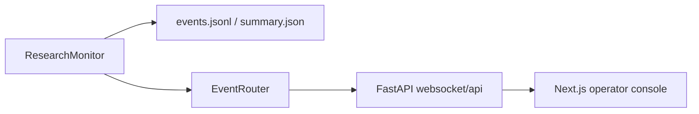

# Real-Time Monitoring

This document summarizes the browser-based monitoring stack that sits alongside the file-backed telemetry system.

Use this path when you want a live operator console in the browser. If you want the Streamlit telemetry analytics UI instead, use `cc-deep-research telemetry dashboard`.

## Architecture

The real-time stack is split into:

- event fan-out: [`src/cc_deep_research/event_router.py`](/Users/jjae/Documents/guthib/cc-deep-research/src/cc_deep_research/event_router.py)
- telemetry emission: [`src/cc_deep_research/monitoring.py`](/Users/jjae/Documents/guthib/cc-deep-research/src/cc_deep_research/monitoring.py)
- FastAPI server and WebSocket routes: [`src/cc_deep_research/web_server.py`](/Users/jjae/Documents/guthib/cc-deep-research/src/cc_deep_research/web_server.py)
- CLI command to launch the backend: [`src/cc_deep_research/cli/dashboard.py`](/Users/jjae/Documents/guthib/cc-deep-research/src/cc_deep_research/cli/dashboard.py)
- dashboard runtime config helpers: [`dashboard/src/lib/runtime-config.ts`](/Users/jjae/Documents/guthib/cc-deep-research/dashboard/src/lib/runtime-config.ts)
- dashboard API and WebSocket clients: [`dashboard/src/lib/api.ts`](/Users/jjae/Documents/guthib/cc-deep-research/dashboard/src/lib/api.ts) and [`dashboard/src/lib/websocket.ts`](/Users/jjae/Documents/guthib/cc-deep-research/dashboard/src/lib/websocket.ts)
- dashboard state and pages: [`dashboard/src/hooks/useDashboard.ts`](/Users/jjae/Documents/guthib/cc-deep-research/dashboard/src/hooks/useDashboard.ts), [`dashboard/src/app/page.tsx`](/Users/jjae/Documents/guthib/cc-deep-research/dashboard/src/app/page.tsx), and [`dashboard/src/app/session/[id]/page.tsx`](/Users/jjae/Documents/guthib/cc-deep-research/dashboard/src/app/session/[id]/page.tsx)



## Backend Responsibilities

### Event router

[`src/cc_deep_research/event_router.py`](/Users/jjae/Documents/guthib/cc-deep-research/src/cc_deep_research/event_router.py) provides in-memory pub/sub for live event delivery.

It handles:

- session-scoped subscriptions
- connection lifecycle tracking
- event broadcast to connected WebSocket clients

### Monitor integration

[`src/cc_deep_research/monitoring.py`](/Users/jjae/Documents/guthib/cc-deep-research/src/cc_deep_research/monitoring.py) persists telemetry and can also publish the same events to an `EventRouter` when real-time mode is enabled.

### FastAPI server

[`src/cc_deep_research/web_server.py`](/Users/jjae/Documents/guthib/cc-deep-research/src/cc_deep_research/web_server.py) exposes:

- `GET /api/sessions`
- `GET /api/sessions/{session_id}`
- `GET /api/sessions/{session_id}/events`
- `GET /ws/session/{session_id}`

The HTTP endpoints combine live telemetry reads with dashboard analytics helpers, while the WebSocket endpoint streams new events for one session.

### CLI command

Launch the backend with:

```bash
cc-deep-research dashboard --host localhost --port 8000
```

Current CLI implementation lives in [`src/cc_deep_research/cli/dashboard.py`](/Users/jjae/Documents/guthib/cc-deep-research/src/cc_deep_research/cli/dashboard.py).

## Frontend Responsibilities

The frontend is a Next.js app in [`dashboard/`](/Users/jjae/Documents/guthib/cc-deep-research/dashboard).

Important pieces:

- home page session list: [`dashboard/src/components/session-list.tsx`](/Users/jjae/Documents/guthib/cc-deep-research/dashboard/src/components/session-list.tsx)
- session detail screen: [`dashboard/src/components/session-details.tsx`](/Users/jjae/Documents/guthib/cc-deep-research/dashboard/src/components/session-details.tsx)
- local dashboard store: [`dashboard/src/hooks/useDashboard.ts`](/Users/jjae/Documents/guthib/cc-deep-research/dashboard/src/hooks/useDashboard.ts)
- API client: [`dashboard/src/lib/api.ts`](/Users/jjae/Documents/guthib/cc-deep-research/dashboard/src/lib/api.ts)
- WebSocket client: [`dashboard/src/lib/websocket.ts`](/Users/jjae/Documents/guthib/cc-deep-research/dashboard/src/lib/websocket.ts)
- runtime host configuration: [`dashboard/src/lib/runtime-config.ts`](/Users/jjae/Documents/guthib/cc-deep-research/dashboard/src/lib/runtime-config.ts)

Current UX surface:

- session overview page
- per-session detail page
- live connection state
- event table and JSON inspection modal
- placeholder graph and timeline views for future visualization work

## How To Run

### 1. Start the backend

```bash
cd /Users/jjae/Documents/guthib/cc-deep-research
uv run cc-deep-research dashboard --port 8000
```

### 2. Start a research run with real-time streaming

```bash
uv run cc-deep-research research "your research query" --enable-realtime
```

### 3. Start the frontend

```bash
cd /Users/jjae/Documents/guthib/cc-deep-research/dashboard
npm install
npm run dev
```

If the backend is not on `http://localhost:8000`, set one of these before `npm run dev`:

```bash
export NEXT_PUBLIC_CC_BACKEND_ORIGIN=http://localhost:8000
export NEXT_PUBLIC_CC_API_BASE_URL=http://localhost:8000/api
export NEXT_PUBLIC_CC_WS_BASE_URL=ws://localhost:8000/ws
```

## Notes

- `cc-deep-research dashboard` starts the FastAPI backend only. The Next.js frontend is run separately from [`dashboard/`](/Users/jjae/Documents/guthib/cc-deep-research/dashboard).
- `cc-deep-research telemetry dashboard` is a different command that launches the Streamlit analytics UI.
- Dashboard-related environment variables currently live in [`src/cc_deep_research/config/schema.py`](/Users/jjae/Documents/guthib/cc-deep-research/src/cc_deep_research/config/schema.py) as settings support, but the dashboard CLI currently takes host and port directly from command flags.
