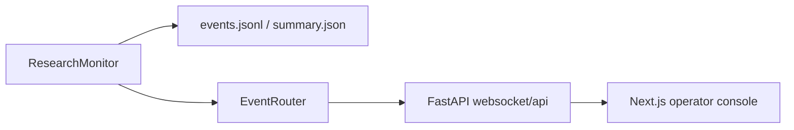

# Real-Time Monitoring

This document summarizes the browser-based monitoring stack that sits alongside the file-backed telemetry system.

## Quick Start (Browser-First)

The fastest way to get started is to use the combined launcher:

```bash
cd dashboard
npm install
npm run dev
```

This starts:
- **Backend API**: http://localhost:8000
- **Frontend Dashboard**: http://localhost:3000

Then open http://localhost:3000 in your browser to:
1. Start research directly from the home page
2. Watch live progress in real-time
3. View the final report when complete

## Architecture

The real-time stack is split into:

- event fan-out: [`src/cc_deep_research/event_router.py`](../src/cc_deep_research/event_router.py)
- telemetry emission: [`src/cc_deep_research/monitoring.py`](../src/cc_deep_research/monitoring.py)
- FastAPI server and WebSocket routes: [`src/cc_deep_research/web_server.py`](../src/cc_deep_research/web_server.py)
- CLI command to launch the backend: [`src/cc_deep_research/cli/dashboard.py`](../src/cc_deep_research/cli/dashboard.py)
- dashboard runtime config helpers: [`dashboard/src/lib/runtime-config.ts`](../dashboard/src/lib/runtime-config.ts)
- dashboard API and WebSocket clients: [`dashboard/src/lib/api.ts`](../dashboard/src/lib/api.ts) and [`dashboard/src/lib/websocket.ts`](../dashboard/src/lib/websocket.ts)
- dashboard state and pages: [`dashboard/src/hooks/useDashboard.ts`](../dashboard/src/hooks/useDashboard.ts), [`dashboard/src/app/page.tsx`](../dashboard/src/app/page.tsx), and [`dashboard/src/app/session/[id]/page.tsx`](../dashboard/src/app/session/[id]/page.tsx)



## Backend Responsibilities

### Event router

[`src/cc_deep_research/event_router.py`](../src/cc_deep_research/event_router.py) provides in-memory pub/sub for live event delivery.

It handles:

- session-scoped subscriptions
- connection lifecycle tracking
- event broadcast to connected WebSocket clients

### Monitor integration

[`src/cc_deep_research/monitoring.py`](../src/cc_deep_research/monitoring.py) persists telemetry and can also publish the same events to an `EventRouter` when real-time mode is enabled.

### FastAPI server

[`src/cc_deep_research/web_server.py`](../src/cc_deep_research/web_server.py) exposes:

- `GET /api/sessions`
- `GET /api/sessions/{session_id}`
- `GET /api/sessions/{session_id}/events`
- `POST /api/research-runs` - Start a new research run from the browser
- `GET /api/research-runs/{run_id}` - Get run status
- `GET /api/sessions/{session_id}/report` - Get final report
- `GET /ws/session/{session_id}`

The HTTP endpoints combine live telemetry reads with dashboard analytics helpers, while the WebSocket endpoint streams new events for one session.

### CLI command

Launch the backend with:

```bash
cc-deep-research dashboard --host localhost --port 8000
```

Current CLI implementation lives in [`src/cc_deep_research/cli/dashboard.py`](../src/cc_deep_research/cli/dashboard.py).

## Frontend Responsibilities

The frontend is a Next.js app in [`dashboard/`](../dashboard).

Important pieces:

- home page session list: [`dashboard/src/components/session-list.tsx`](../dashboard/src/components/session-list.tsx)
- research start form: [`dashboard/src/components/start-research-form.tsx`](../dashboard/src/components/start-research-form.tsx)
- session detail screen: [`dashboard/src/components/session-details.tsx`](../dashboard/src/components/session-details.tsx)
- local dashboard store: [`dashboard/src/hooks/useDashboard.ts`](../dashboard/src/hooks/useDashboard.ts)
- API client: [`dashboard/src/lib/api.ts`](../dashboard/src/lib/api.ts)
- WebSocket client: [`dashboard/src/lib/websocket.ts`](../dashboard/src/lib/websocket.ts)
- runtime host configuration: [`dashboard/src/lib/runtime-config.ts`](../dashboard/src/lib/runtime-config.ts)
- content-gen pipeline detail: [`dashboard/src/app/content-gen/pipeline/[id]/page.tsx`](../dashboard/src/app/content-gen/pipeline/[id]/page.tsx)
- content-gen WebSocket handler: [`dashboard/src/hooks/useContentGen.ts`](../dashboard/src/hooks/useContentGen.ts)

Current UX surface:

- research start form on home page
- session overview page
- per-session detail page with live status summary
- final report view
- live connection state
- D3 workflow graph with pan, zoom, and click-to-inspect nodes
- agent swimlane timeline with concurrent markers
- dedicated tool execution panel
- dedicated LLM reasoning panel
- virtualized event table and raw JSON inspection modal
- content-generation pipeline detail page with stage-by-stage progress
- live pipeline operator visibility via WebSocket updates

## Development Options

### Combined Launcher (Recommended)

Start both backend and frontend together:

```bash
cd dashboard
npm run dev
```

This starts:
- **Backend**: http://localhost:8000
- **Frontend**: http://localhost:3000

Press Ctrl+C to stop both processes.

### Frontend-Only Development

For frontend debugging without the backend:

```bash
cd dashboard
npm run dev:frontend
```

### CLI-Driven Research (Legacy)

If you prefer starting research from the terminal:

```bash
# Terminal 1: Start the backend
uv run cc-deep-research dashboard --port 8000

# Terminal 2: Start the frontend
cd dashboard && npm run dev:frontend

# Terminal 3: Run research
uv run cc-deep-research research "your query" --enable-realtime
```

## Environment Variables

If the backend is not on `http://localhost:8000`, set one of these before starting:

```bash
export NEXT_PUBLIC_CC_BACKEND_ORIGIN=http://localhost:8000
export NEXT_PUBLIC_CC_API_BASE_URL=http://localhost:8000/api
export NEXT_PUBLIC_CC_WS_BASE_URL=ws://localhost:8000/ws
```

## Notes

- `cc-deep-research dashboard` starts the FastAPI backend only. The Next.js frontend is run separately from [`dashboard/`](../dashboard).
- `cc-deep-research telemetry dashboard` is a different command that launches the Streamlit analytics UI.
- Dashboard-related environment variables currently live in [`src/cc_deep_research/config/schema.py`](../src/cc_deep_research/config/schema.py) as settings support, but the dashboard CLI currently takes host and port directly from command flags.
- The dashboard UI now uses local `shadcn/ui`-style primitives declared in [`dashboard/components.json`](../dashboard/components.json) and implemented in [`dashboard/src/components/ui/`](../dashboard/src/components/ui).
- Live-session performance depends on buffered WebSocket updates, lazy-loaded heavy panels, and a virtualized event table. If a session is especially noisy, those are the first guardrails to preserve before adding more visualization work.
- Content-generation pipelines use a separate WebSocket endpoint at `/ws/content-gen/pipeline/{pipelineId}` for live operator visibility.
- Stage-completion, skip, and failure events include the latest pipeline-context snapshot so the detail page can render stage content progressively while a run is still active.
- Reloading a pipeline detail page mid-run rehydrates from the latest in-memory context stored in the backend job registry.
