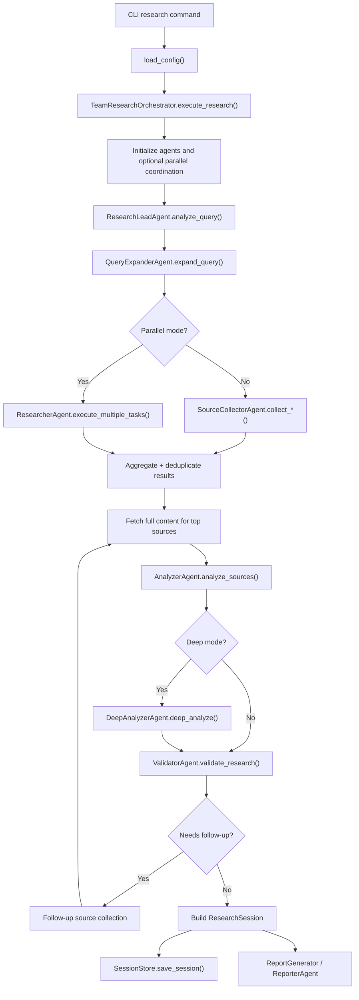

# Research Workflow Design

This document explains how the research workflow in `cc-deep-research` is designed, how the runtime moves through each phase, which modules own each responsibility, and where the current implementation diverges from the broader multi-agent design described in comments and CLI help.

## Purpose

The system is designed to turn a single user query into a persisted research session with:

- query planning
- multi-query source collection
- optional parallel execution
- source deduplication and content enrichment
- AI-assisted synthesis
- quality validation
- iterative follow-up search
- final report generation
- telemetry and session persistence

At a high level, the workflow is a staged pipeline managed by the orchestrator, not by the `ResearchTeam` wrapper.

## Primary Runtime Path

The main runtime path for a CLI research run is:

1. CLI parses flags and loads configuration.
2. CLI builds a `TeamResearchOrchestrator`.
3. Orchestrator initializes local agent objects and optional parallel coordination primitives.
4. Lead agent derives a strategy from the query and depth.
5. Query expander produces search variations when depth requires it.
6. Source collector or parallel researchers gather results from providers.
7. Results are deduplicated and top-ranked sources are enriched with fetched page content.
8. Analyzer produces findings, themes, cross-reference output, and gaps.
9. Deep mode adds a second analysis layer with multi-pass synthesis.
10. Validator scores quality and generates follow-up queries when the run is weak.
11. Orchestrator optionally performs iterative follow-up collection and reruns analysis.
12. Orchestrator returns a `ResearchSession`.
13. CLI persists the session and renders Markdown or JSON output.

## Execution Diagram

## Workflow Owner

The workflow owner is [`src/cc_deep_research/orchestrator.py`](/Users/jjae/Documents/guthib/cc-deep-research/src/cc_deep_research/orchestrator.py).

`TeamResearchOrchestrator.execute_research()` is the authoritative implementation of the pipeline. It handles:

- phase ordering
- monitor events
- team and agent initialization
- sequential versus parallel source collection
- iterative follow-up passes
- session assembly
- cleanup

Although the codebase includes a `ResearchTeam` abstraction, that class is mostly a placeholder lifecycle wrapper. It does not execute the research workflow itself.

## Entry Point and User Controls

The CLI entry point is [`src/cc_deep_research/cli.py`](/Users/jjae/Documents/guthib/cc-deep-research/src/cc_deep_research/cli.py).

The `research` command controls the workflow through flags such as:

- `--depth`
- `--sources`
- `--no-cross-ref`
- `--tavily-only`
- `--claude-only`
- `--no-team`
- `--parallel-mode`
- `--num-researchers`
- `--monitor`
- `--show-timeline`
- `--pdf`

Important implementation detail:

- `--no-team` forces sequential source collection. It does not switch to a separate non-agent pipeline.
- Parallel behavior is driven by `parallel_mode` and `config.search_team.parallel_execution`.

## Configuration That Shapes the Workflow

The workflow is parameterized by [`src/cc_deep_research/config.py`](/Users/jjae/Documents/guthib/cc-deep-research/src/cc_deep_research/config.py).

The most relevant settings are:

- `search.providers`: search backends to use
- `research.default_depth`: default depth mode
- `research.min_sources`: target source count by depth
- `research.enable_iterative_search`: whether follow-up loops run
- `research.max_iterations`: cap on iterative passes
- `research.deep_analysis_passes`: deep analysis intensity
- `research.top_sources_for_content`: how many sources get full-page enrichment
- `research.ai_integration_method`: `heuristic`, `api`, or `hybrid`
- `search_team.parallel_execution`: default parallel collection mode
- `search_team.num_researchers`: number of parallel tasks
- `search_team.researcher_timeout`: timeout per parallel researcher

## Data Model

The core runtime model lives in [`src/cc_deep_research/models.py`](/Users/jjae/Documents/guthib/cc-deep-research/src/cc_deep_research/models.py).

The main objects are:

- `ResearchDepth`: `quick`, `standard`, `deep`
- `SearchOptions`: provider request controls
- `SearchResultItem`: normalized source object
- `SearchResult`: one provider response for one query
- `ResearchSession`: final session artifact returned by the orchestrator

`ResearchSession` is the durable product of a run. It carries:

- source list
- timing
- original query
- depth
- metadata such as strategy, analysis, validation, iteration history, and provider list

## Phase-by-Phase Design

### 1. Team and Agent Initialization

Initialization happens in `TeamResearchOrchestrator._initialize_team()`.

This phase creates:

- a `ResearchTeam` wrapper
- a local registry of specialized agents
- optional `MessageBus` and `AgentPool` instances for parallel mode

The actual agent instances used by the workflow are local Python objects:

- `ResearchLeadAgent`
- `SourceCollectorAgent`
- `QueryExpanderAgent`
- `AnalyzerAgent`
- `DeepAnalyzerAgent`
- `ReporterAgent`
- `ValidatorAgent`

Design intent:

- keep the orchestration surface stable
- allow future replacement of local agent calls with real external agent runtimes
- isolate each workflow concern into a narrow component

Current reality:

- the local Python agent objects perform the real work
- `ResearchTeam`, `AgentPool`, and `MessageBus` are only partial infrastructure

### 2. Strategy Analysis

Strategy analysis is handled by [`src/cc_deep_research/agents/research_lead.py`](/Users/jjae/Documents/guthib/cc-deep-research/src/cc_deep_research/agents/research_lead.py).

The lead agent:

- estimates query complexity
- builds a lightweight query profile
- detects intent such as comparison or explanatory framing
- detects time sensitivity
- derives a strategy from the requested depth

The strategy includes:

- number of query variations
- source expectations
- whether quality scoring is enabled
- task list
- follow-up bias
- key terms

Design tradeoff:

- planning is intentionally heuristic and cheap
- the system prefers deterministic setup over spending an LLM call before search begins

### 3. Query Expansion

Query expansion is handled by [`src/cc_deep_research/agents/query_expander.py`](/Users/jjae/Documents/guthib/cc-deep-research/src/cc_deep_research/agents/query_expander.py).

Expansion is depth-sensitive:

- `quick`: typically keep only the original query
- `standard`: generate a few variants
- `deep`: generate broader coverage variants

The expander currently uses heuristics rather than semantic generation. It:

- creates simple rephrasings
- adds context-oriented variants
- adds time-sensitive variants when needed
- validates relevance by keyword overlap

Design intent:

- widen coverage without losing query intent
- provide the collection layer with multiple retrieval angles

Current limitation:

- the expansion logic is simple and can produce repetitive or low-value variants for some topics

### 4. Source Collection

Source collection is handled by [`src/cc_deep_research/agents/source_collector.py`](/Users/jjae/Documents/guthib/cc-deep-research/src/cc_deep_research/agents/source_collector.py).

The collector:

- resolves configured providers
- initializes provider clients
- issues searches for one or many queries
- aggregates provider results
- tolerates partial provider failure

Provider behavior today:

- Tavily is implemented
- Claude is declared in config and CLI flags but is not implemented as a real provider

The Tavily provider lives in [`src/cc_deep_research/providers/tavily.py`](/Users/jjae/Documents/guthib/cc-deep-research/src/cc_deep_research/providers/tavily.py) and returns normalized `SearchResultItem` objects with:

- URL
- title
- snippet
- raw content when provided by Tavily
- score
- source metadata such as published date

### 5. Aggregation and Deduplication

Aggregation is handled by [`src/cc_deep_research/aggregation.py`](/Users/jjae/Documents/guthib/cc-deep-research/src/cc_deep_research/aggregation.py).

The aggregator:

- merges results from multiple queries or providers
- normalizes URLs
- removes duplicates
- keeps the highest-scoring duplicate
- sorts by score descending

This stage is critical because the workflow often fans out query variants and then collapses them back into one ranked source set before analysis.

### 6. Content Enrichment

After collection, the orchestrator fetches full page content for top-ranked sources in `_fetch_content_for_top_sources()`.

This stage exists because provider snippets and raw content are often incomplete. The enrichment step:

- selects the highest-scoring sources
- skips sources that already have substantial content
- fetches page content through the `web_reader` MCP integration
- caches content by URL for reuse across iterations

Design intent:

- improve downstream AI analysis quality
- spend enrichment effort only on likely high-value sources

Operational note:

- if `web_reader` is unavailable, the run continues with provider content only

### 7. Analysis

Primary analysis is handled by [`src/cc_deep_research/agents/analyzer.py`](/Users/jjae/Documents/guthib/cc-deep-research/src/cc_deep_research/agents/analyzer.py) with support from [`src/cc_deep_research/agents/ai_analysis_service.py`](/Users/jjae/Documents/guthib/cc-deep-research/src/cc_deep_research/agents/ai_analysis_service.py).

The analyzer:

- cleans noisy webpage content
- chooses AI-powered analysis when enough content is available
- falls back to basic analysis when content is shallow
- extracts themes
- performs cross-reference analysis
- identifies gaps
- synthesizes key findings

The AI analysis service is designed with multiple modes:

- `api`: use an LLM client directly
- `heuristic`: use rule-based or lightweight logic only
- `hybrid`: prefer LLM, fall back to heuristics

This split is a design decision to keep the workflow usable when:

- no Anthropic key is configured
- cost needs to be controlled
- content is too sparse for a strong semantic pass

### 8. Deep Analysis

Deep mode adds `DeepAnalyzerAgent`, implemented in [`src/cc_deep_research/agents/deep_analyzer.py`](/Users/jjae/Documents/guthib/cc-deep-research/src/cc_deep_research/agents/deep_analyzer.py).

This pass is designed as a second analysis layer, not just "more sources".

It performs three conceptual passes:

1. theme and pattern extraction
2. cross-reference and disagreement analysis
3. synthesis of implications and broader meaning

Design intent:

- separate first-pass extraction from deeper synthesis
- make deep mode qualitatively different from standard mode

Current implementation:

- still relies on the same AI analysis service underneath
- adds broader thematic coverage and more explicit implication synthesis

### 9. Validation

Validation is handled by [`src/cc_deep_research/agents/validator.py`](/Users/jjae/Documents/guthib/cc-deep-research/src/cc_deep_research/agents/validator.py).

The validator scores whether the run is usable by checking:

- minimum source count
- domain diversity
- content depth
- analysis gaps
- citation completeness

It returns:

- `is_valid`
- `issues`
- `warnings`
- `recommendations`
- `quality_score`
- `follow_up_queries`
- `needs_follow_up`

This is the key bridge between analysis and iteration. The validator does not just score the run; it proposes the next retrieval actions.

### 10. Iterative Follow-Up Search

The orchestrator’s `_run_analysis_workflow()` turns the pipeline into a loop instead of a single pass.

Loop behavior:

1. run analysis
2. run validation
3. collect follow-up queries from validation or gap output
4. execute another retrieval pass
5. merge new and old sources
6. repeat until no new value is found or iteration limit is reached

This is one of the most important design choices in the project. The system is built to improve a weak first pass instead of assuming the initial retrieval set is sufficient.

Stop conditions include:

- iterative search disabled
- max iterations reached
- validator does not request follow-up
- no follow-up queries remain after deduplication
- follow-up collection adds no new unique sources

Iteration history is stored in `session.metadata["iteration_history"]`.

### 11. Parallel Research Mode

Parallel collection is implemented inside the orchestrator and [`src/cc_deep_research/agents/researcher.py`](/Users/jjae/Documents/guthib/cc-deep-research/src/cc_deep_research/agents/researcher.py).

In parallel mode:

- the orchestrator decomposes query variations into task dictionaries
- a `ResearcherAgent` executes those tasks concurrently with `asyncio.gather`
- results are aggregated and deduplicated afterward

Design intent:

- reduce wall-clock time for multi-query retrieval
- make deep runs more practical
- preserve a future path to actual multi-agent execution

Current implementation detail:

- this is concurrent task execution inside one process, not true distributed or spawned external agents
- `AgentPool` and `MessageBus` are initialized, but they are not the mechanism actually used to run task bodies today

That distinction matters when changing the architecture. The codebase talks about agent teams, but the runtime is currently closer to "specialized local components with optional concurrent retrieval."

### 12. Report Generation

Reporting is handled by [`src/cc_deep_research/reporting.py`](/Users/jjae/Documents/guthib/cc-deep-research/src/cc_deep_research/reporting.py) and [`src/cc_deep_research/agents/reporter.py`](/Users/jjae/Documents/guthib/cc-deep-research/src/cc_deep_research/agents/reporter.py).

The reporter generates:

- Markdown reports for humans
- JSON reports for downstream tooling

Report sections are designed to include:

- executive summary
- methodology
- key findings
- detailed analysis
- evidence quality analysis
- cross-reference analysis
- safety and contraindications
- research gaps and limitations
- sources
- research metadata

The reporting layer depends on `session.metadata["analysis"]` being the canonical analysis artifact from the orchestrator.

`ResearchSession.metadata` is a stable workflow contract, not an ad hoc bag of fields. Every saved session includes the same top-level keys:

- `strategy`: orchestration strategy output
- `analysis`: canonical analysis payload for reporting and UI
- `validation`: validator output, or `{}` when no validation payload exists
- `iteration_history`: iterative follow-up search history
- `providers`: configured providers, available providers, warnings, and an explicit provider `status`
- `execution`: parallel-mode intent, whether parallel collection actually ran, and any degraded-run reasons
- `deep_analysis`: whether deep analysis was requested, whether it completed, and explicit degraded/not-requested state

This contract applies to quick, standard, and deep runs. Degraded states are represented explicitly in `providers`, `execution`, and `deep_analysis` instead of being inferred from absent keys.

### 13. Persistence and Telemetry

Persistence is handled by [`src/cc_deep_research/session_store.py`](/Users/jjae/Documents/guthib/cc-deep-research/src/cc_deep_research/session_store.py).

Each run is saved as a JSON session file containing:

- query
- depth
- timestamps
- searches
- sources
- metadata

Telemetry and monitor output are handled through `ResearchMonitor`, which the orchestrator calls at each phase boundary and during provider execution.

Design intent:

- make runs inspectable after completion
- support dashboards and performance analysis
- preserve reasoning summaries for debugging

## Designed Roles vs Current Responsibilities

The project uses agent-oriented naming, but the current architecture is mixed. The table below is the important mental model for contributors.

| Layer | Designed role | Current implementation status |
| --- | --- | --- |
| `TeamResearchOrchestrator` | End-to-end workflow owner | Real and authoritative |
| `ResearchLeadAgent` | Strategy and planning | Real, heuristic |
| `QueryExpanderAgent` | Query diversification | Real, heuristic |
| `SourceCollectorAgent` | Provider orchestration | Real |
| `AnalyzerAgent` | Main synthesis | Real |
| `DeepAnalyzerAgent` | Multi-pass deep synthesis | Real |
| `ValidatorAgent` | Quality gate and loop trigger | Real |
| `ReporterAgent` | Final report assembly | Real |
| `ResearchTeam` | Team lifecycle / coordination wrapper | Placeholder |
| `AgentPool` | Spawn/manage researchers | Placeholder infrastructure |
| `MessageBus` | Inter-agent messaging | Placeholder infrastructure |

## Design Principles Visible in the Code

Several design principles recur across the workflow:

### Stage Separation

Each major concern has its own component. Planning, collection, synthesis, validation, and reporting are not collapsed into one large class.

### Graceful Degradation

The system prefers partial success over hard failure:

- missing providers surface warnings
- failed provider calls do not necessarily fail the run
- missing `web_reader` disables enrichment, not the session
- AI analysis can fall back to heuristic logic

### Quality-Driven Iteration

Validation is not terminal bookkeeping. It actively steers more retrieval when the run lacks source count, diversity, depth, or citation coverage.

### Retrieval Before Heavy Synthesis

The workflow spends effort building a stronger source set before report generation. This is the right shape for a research tool because weak retrieval quality cannot be repaired by better formatting.

### Observability

Telemetry hooks are embedded in provider calls, phase transitions, and researcher events so that a run can be debugged after the fact.

## Known Architectural Gaps

Contributors should understand these current gaps before extending the workflow:

### Team abstractions are ahead of execution reality

The repository includes team and coordination primitives, but the orchestrator still directly invokes local Python objects. Do not assume a true message-driven multi-agent runtime exists yet.

### Provider support is incomplete

`claude` can be selected in configuration, but no real Claude search provider is implemented. Source collection is effectively Tavily-centric today.

### Parallel mode is narrower than it sounds

Parallel mode currently means concurrent execution of retrieval tasks in one runtime. It is not external worker orchestration.

### Report generation is downstream-only

The reporter does not decide what to research next. All loop control belongs in the orchestrator and validator.

### Strategy and expansion are heuristic

The up-front planning path is intentionally lightweight. If richer planning is added, it should preserve determinism, cost controls, and testability.

## Extension Points

The safest places to extend the workflow are:

### Add a provider

- implement `SearchProvider`
- register it in collector initialization
- ensure results normalize to `SearchResultItem`
- keep aggregation and validation unchanged

### Improve planning

- enhance `ResearchLeadAgent.analyze_query()`
- preserve the strategy contract expected by the orchestrator

### Improve query expansion

- replace heuristics in `QueryExpanderAgent`
- keep relevance filtering and deterministic limits

### Improve analysis quality

- extend `AIAnalysisService`
- avoid changing report contracts unless necessary

### Improve validation

- add stronger quality metrics
- keep `follow_up_queries` and `needs_follow_up` semantics stable

### Introduce real multi-agent execution

- treat `ResearchTeam`, `AgentPool`, and `MessageBus` as scaffolding
- keep the orchestrator as the coordination boundary
- migrate one phase at a time rather than replacing the whole pipeline at once

## Contributor Guidance

When changing the workflow:

1. Start with the orchestrator because it defines phase order and contracts.
2. Treat `ResearchSession.metadata` as part of the workflow API.
3. Preserve graceful fallback behavior.
4. Keep iterative search semantics intact unless intentionally redesigning them.
5. Be explicit about whether a change affects sequential mode, parallel mode, or both.
6. Update tests around follow-up query generation, iteration stopping conditions, and output metadata when behavior changes.

## Relevant Files

- [`src/cc_deep_research/cli.py`](/Users/jjae/Documents/guthib/cc-deep-research/src/cc_deep_research/cli.py)
- [`src/cc_deep_research/orchestrator.py`](/Users/jjae/Documents/guthib/cc-deep-research/src/cc_deep_research/orchestrator.py)
- [`src/cc_deep_research/config.py`](/Users/jjae/Documents/guthib/cc-deep-research/src/cc_deep_research/config.py)
- [`src/cc_deep_research/models.py`](/Users/jjae/Documents/guthib/cc-deep-research/src/cc_deep_research/models.py)
- [`src/cc_deep_research/aggregation.py`](/Users/jjae/Documents/guthib/cc-deep-research/src/cc_deep_research/aggregation.py)
- [`src/cc_deep_research/agents/research_lead.py`](/Users/jjae/Documents/guthib/cc-deep-research/src/cc_deep_research/agents/research_lead.py)
- [`src/cc_deep_research/agents/query_expander.py`](/Users/jjae/Documents/guthib/cc-deep-research/src/cc_deep_research/agents/query_expander.py)
- [`src/cc_deep_research/agents/source_collector.py`](/Users/jjae/Documents/guthib/cc-deep-research/src/cc_deep_research/agents/source_collector.py)
- [`src/cc_deep_research/agents/researcher.py`](/Users/jjae/Documents/guthib/cc-deep-research/src/cc_deep_research/agents/researcher.py)
- [`src/cc_deep_research/agents/analyzer.py`](/Users/jjae/Documents/guthib/cc-deep-research/src/cc_deep_research/agents/analyzer.py)
- [`src/cc_deep_research/agents/deep_analyzer.py`](/Users/jjae/Documents/guthib/cc-deep-research/src/cc_deep_research/agents/deep_analyzer.py)
- [`src/cc_deep_research/agents/validator.py`](/Users/jjae/Documents/guthib/cc-deep-research/src/cc_deep_research/agents/validator.py)
- [`src/cc_deep_research/agents/reporter.py`](/Users/jjae/Documents/guthib/cc-deep-research/src/cc_deep_research/agents/reporter.py)
- [`src/cc_deep_research/coordination/agent_pool.py`](/Users/jjae/Documents/guthib/cc-deep-research/src/cc_deep_research/coordination/agent_pool.py)
- [`src/cc_deep_research/coordination/message_bus.py`](/Users/jjae/Documents/guthib/cc-deep-research/src/cc_deep_research/coordination/message_bus.py)
- [`src/cc_deep_research/session_store.py`](/Users/jjae/Documents/guthib/cc-deep-research/src/cc_deep_research/session_store.py)
