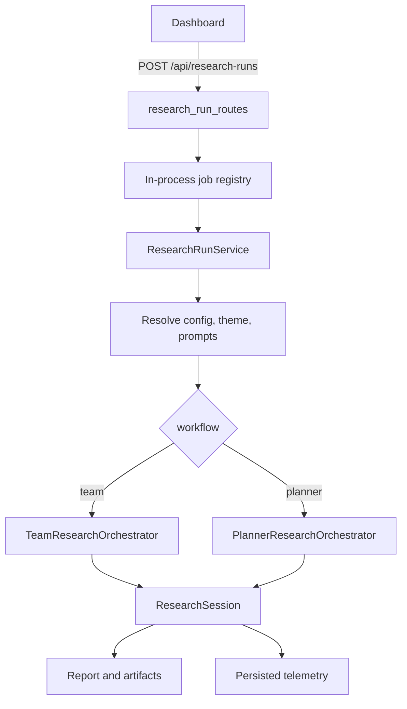

# Research Workflow

The research workflow is a backend service boundary shared by the dashboard,
API routes, tests, and future automation. The removed Click CLI is no longer an
execution owner.

## Request path


```mermaid
flowchart TD
    A["Dashboard"] -->|POST /api/research-runs| B["research_run_routes"]
    B --> C["In-process job registry"]
    C --> D["ResearchRunService"]
    D --> E["Resolve config, theme, prompts"]
    E --> F{"workflow"}
    F -->|team| G["TeamResearchOrchestrator"]
    F -->|planner| H["PlannerResearchOrchestrator"]
    G --> I["ResearchSession"]
    H --> I
    I --> J["Report and artifacts"]
    I --> K["Persisted telemetry"]
```

The route returns `202 Accepted` immediately. Execution runs in a worker
thread, and status is available from `GET /api/research-runs/{run_id}`.

## Service ownership

| Area | Owner |
| --- | --- |
| HTTP request/status/cancellation | `web_server_routes/research_run_routes.py` |
| Reusable execution contract | `research_runs/service.py` |
| Request models and lifecycle states | `research_runs/models.py` |
| Request-specific config overrides | `research_runs/options.py` |
| Report and artifact materialization | `research_runs/output.py` |
| Team workflow | `orchestrator.py` and `orchestration/` |
| Planner workflow | `orchestration/planner_orchestrator.py` |
| Events and lifecycle telemetry | `monitoring.py` |
| Session persistence | `session_store.py` |

Keep transport behavior in the routes and research behavior in
`ResearchRunService`. A new caller should construct a `ResearchRunRequest` and
call the service rather than duplicating orchestration setup.

## Execution phases

The exact agent plan varies by workflow and detected theme, but the service
contract is stable:

1. load and copy configuration;
2. detect or apply the research theme;
3. apply request and theme overrides;
4. construct the prompt registry;
5. choose the team or planner orchestrator;
6. start real-time routing when requested;
7. execute research with cancellation and phase hooks;
8. finalize monitor state;
9. materialize the report and artifacts;
10. persist session output for later retrieval.

## Supported invocation

Use the dashboard, or call the API:

```bash
curl -sS http://127.0.0.1:8000/api/research-runs \
  -H 'content-type: application/json' \
  -d '{
    "query": "What evidence supports local-first AI tooling?",
    "depth": "quick",
    "workflow": "team",
    "realtime_enabled": true
  }'
```

Use the returned `run_id` to poll status or request cancellation. Once
`session_id` is present, read events, reports, and artifacts through
`/api/sessions/{session_id}/...`.

Interrupted runs persist checksum-protected state at completed workflow
boundaries. `POST /api/sessions/{session_id}/resume` queues a distinct child
run from the latest executable checkpoint (or a selected `checkpoint_id`).
The response includes the original run/session, checkpoint, and resume-attempt
lineage. Legacy summary-only checkpoints remain inspectable but are not
advertised as executable resume points.

## Extension rules

- Add new request options to the typed models and central override layer.
- Keep provider calls and research policy out of FastAPI route functions.
- Emit lifecycle events through `ResearchMonitor`; do not write ad hoc
  dashboard-only state.
- Preserve cooperative cancellation checks around expensive phases.
- Test the reusable service separately from the HTTP adapter.
- Treat saved sessions as a compatibility boundary.

For the event-level interaction trace, see
[`RESEARCH_WORKFLOW_AGENT_INTERACTIONS.md`](RESEARCH_WORKFLOW_AGENT_INTERACTIONS.md).
