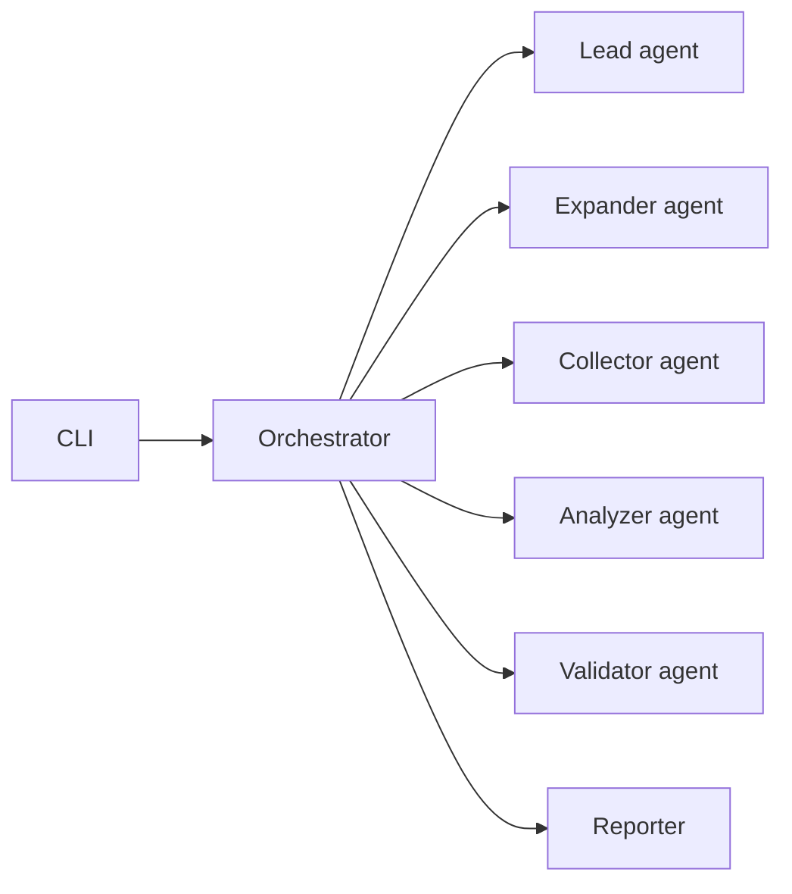
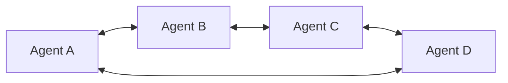
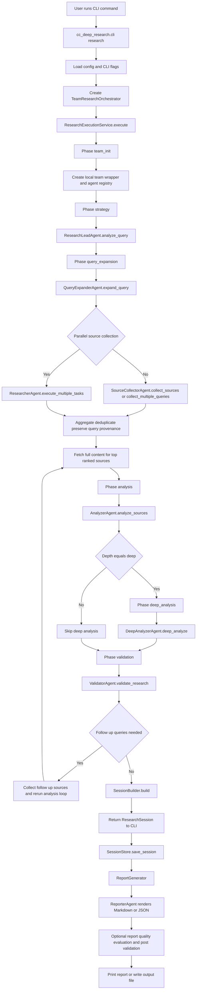
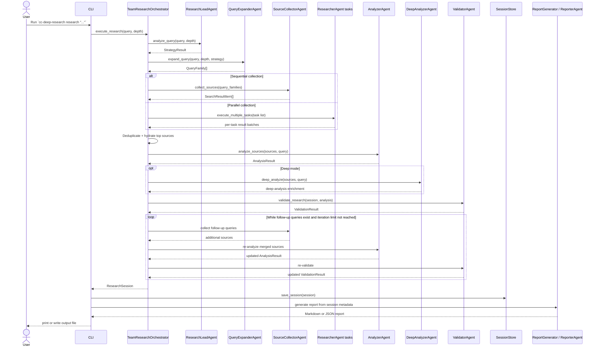

# Research Workflow and Agent Interactions

This document explains how the current `cc-deep-research` codebase executes a research run, where each agent fits, and how "multi-agent" behavior actually works in practice.

It is based on the current repository code, not on aspirational comments alone.

## Executive Summary

The runtime is an orchestrator-led local pipeline:

- The CLI builds a `TeamResearchOrchestrator`.
- The orchestrator runs a fixed sequence of phases: planning, query expansion, source collection, analysis, validation, optional follow-up loops, and session assembly.
- Specialized agents exist, but they do not directly coordinate with each other in the main path.
- The orchestrator is the real coordinator. Most agent interaction is orchestrator-to-agent, not agent-to-agent.
- Parallel mode is limited to source collection. It uses concurrent local researcher tasks, not a distributed agent swarm.

## Reality Check

This section answers a simple question:

When you run `cc-deep-research research "..."`, what is actually executing?

### Short answer

Today, the system works like this:

- one local Python process runs the whole research job
- one orchestrator object controls the order of work
- specialist "agents" are mostly normal Python classes in the same process
- the orchestrator calls those agents directly with method calls
- only source collection has real concurrency, and even that is local async task fan-out

So the codebase has agent roles, but not a fully autonomous agent network.

### What is real today

These parts are part of the real execution path for a normal CLI run:

- `TeamResearchOrchestrator`
- `ResearchExecutionService`
- `ResearchPlanningService`
- `SourceCollectionService`
- `AnalysisWorkflow`
- the specialist agents such as `ResearchLeadAgent`, `QueryExpanderAgent`, `SourceCollectorAgent`, `AnalyzerAgent`, and `ValidatorAgent`

These components do real work when a user runs the CLI.

### What is mostly scaffolding today

These classes mostly describe a future or more ambitious architecture shape:

- `LocalResearchTeam`
- `LocalMessageBus`
- `LocalAgentPool`

They matter because they show what the project might grow into, but they are not the main engine of the current workflow.

In plain terms:

- `LocalResearchTeam` is not the thing that executes the whole research pipeline
- `LocalMessageBus` is not how normal research phases talk to each other
- `LocalAgentPool` is not a real distributed worker fleet

### The easiest mental model

Think of the current system like this:

That is much closer to the truth than this model:

The current repo is mostly the first diagram, not the second.

### What "scaffolding" means here

In this document, "scaffolding" means:

- the class exists
- the class may hold metadata, placeholders, or compatibility behavior
- but the class is not the main place where the actual research work happens

Concrete examples:

- `LocalResearchTeam.execute_research()` raises `NotImplementedError`, so it is not the true workflow runner
- `LocalMessageBus` supports sending and receiving messages, but the main research run does not depend on it
- `LocalAgentPool` tracks local task state, but it does not launch real external agents

### What "hot path" means here

"Hot path" just means the code path used on a normal real run.

For this repo, the hot path is roughly:

1. CLI starts the run
2. `TeamResearchOrchestrator` drives the phases
3. specialist agents are called directly
4. results are assembled into `ResearchSession`
5. reporting turns that session into Markdown or JSON

If a class is not involved in that path, it is not part of the main runtime.

### Parallel mode is narrower than it sounds

It is easy to read "multi-agent" and imagine several autonomous workers reasoning together.

That is not what currently happens.

What actually happens in parallel mode is:

- query families are decomposed into tasks
- `ResearcherAgent.execute_multiple_tasks()` runs those tasks concurrently
- results are merged back into one source list

So parallel mode is a search fan-out optimization, not a conversational multi-agent society.

### Why this distinction matters

If you are extending the project, this section tells you where to make changes:

- if you want to change real workflow behavior, edit the orchestrator, orchestration services, or active specialist agents
- if you edit only `LocalResearchTeam` or `LocalMessageBus`, you may change architecture scaffolding without changing the main CLI behavior

### Local runtime boundary

`src/cc_deep_research/orchestration/runtime.py` now contains the concrete local
runtime boundary used by the orchestrator.

That module is responsible for:

- building the local team metadata wrapper
- instantiating the in-process specialist agents
- creating the optional local message bus
- creating the optional local agent pool for parallel source fan-out
- shutting those local resources down after the run

It still does not implement a distributed worker runtime. It makes the existing
local runtime explicit and testable.

## End-to-End Workflow

## Phase-by-Phase Breakdown

### 1. CLI bootstrap

Entry point: `src/cc_deep_research/cli/main.py`

The CLI:

- parses user flags
- loads config
- resolves execution mode such as `--no-team` or `--parallel-mode`
- constructs `TeamResearchOrchestrator`
- runs the async research workflow
- saves the returned `ResearchSession`
- generates final Markdown or JSON output

Important detail:

- `--no-team` does not switch to a different architecture
- it only disables parallel source collection

### 2. Strategy analysis

Primary component: `ResearchLeadAgent`

Implementation: `src/cc_deep_research/agents/research_lead.py`

The lead agent is responsible for cheap, deterministic planning:

- estimate query complexity
- detect intent
- detect time sensitivity
- infer target source classes
- choose query variation count
- decide whether validation and follow-up quality scoring should run

Output artifact:

- `StrategyResult`

This is the first shared planning contract used by later phases.

### 3. Query expansion

Primary component: `QueryExpanderAgent`

Implementation: `src/cc_deep_research/agents/query_expander.py`

The expander turns the original query into labeled `QueryFamily` objects such as:

- `baseline`
- `primary-source`
- `expert-analysis`
- `current-updates`
- `risk` or `opposing-view`

Each query family carries:

- the actual search query
- a family label
- retrieval intent tags

That provenance is important because the system later stores which query variant produced which source.

### 4. Source collection

Primary components:

- `SourceCollectorAgent`
- `ResearcherAgent` in parallel mode

Main implementations:

- `src/cc_deep_research/agents/source_collector.py`
- `src/cc_deep_research/agents/researcher.py`
- `src/cc_deep_research/orchestration/source_collection.py`

There are two collection modes.

Sequential mode:

- the orchestrator calls `SourceCollectorAgent`
- the collector initializes configured providers
- the collector searches one query or many query families
- results are aggregated and deduplicated

Parallel mode:

- the orchestrator fans query families into task dictionaries
- `ResearcherAgent.execute_multiple_tasks()` runs those tasks concurrently with `asyncio.gather`
- task results are merged back together

Current limitation:

- parallel collection is effectively Tavily-only
- it does not use peer-to-peer agent messaging

### 5. Source enrichment and deduplication

Supporting components:

- `ResultAggregator`
- `SourceCollectionService.fetch_content_for_top_sources()`

Implementations:

- `src/cc_deep_research/aggregation.py`
- `src/cc_deep_research/orchestration/source_collection.py`

After search results arrive, the system:

- deduplicates by normalized URL
- merges metadata from duplicates
- preserves combined query provenance
- keeps higher-scored items first
- optionally fetches full page content for top-ranked sources

Content fetching currently tries to use the optional `web_reader` MCP tool when the source content is thin.

### 6. Analysis

Primary component: `AnalyzerAgent`

Implementation: `src/cc_deep_research/agents/analyzer.py`

The analyzer:

- cleans source content
- extracts themes
- performs cross-reference analysis
- identifies gaps
- synthesizes findings
- produces structured claims with evidence links when possible

Output artifact:

- `AnalysisResult`

If source content is weak, the analyzer falls back to more basic keyword-driven behavior.

### 7. Deep analysis

Primary component: `DeepAnalyzerAgent`

Implementation: `src/cc_deep_research/agents/deep_analyzer.py`

Deep mode adds a second analysis layer with three conceptual passes:

1. theme and pattern extraction
2. cross-reference and disagreement analysis
3. synthesis and implication generation

This phase enriches the existing `AnalysisResult` rather than replacing the entire workflow.

### 8. Validation and iterative follow-up

Primary component: `ValidatorAgent`

Implementation: `src/cc_deep_research/agents/validator.py`

The validator scores the run on dimensions like:

- source count
- domain diversity
- content depth
- freshness fitness
- primary-source coverage
- claim support density
- contradiction pressure
- source-type diversity

If the run is weak, validation can generate follow-up queries. The orchestrator then:

- collects additional sources
- merges them into the existing source set
- reruns analysis
- reruns validation

This loop continues until:

- quality is acceptable
- no useful follow-up queries are available
- or the configured iteration limit is reached

### 9. Session assembly and report generation

Primary components:

- `SessionBuilder`
- `SessionStore`
- `ReportGenerator`
- `ReporterAgent`

Implementations:

- `src/cc_deep_research/orchestration/session_builder.py`
- `src/cc_deep_research/session_store.py`
- `src/cc_deep_research/reporting.py`
- `src/cc_deep_research/agents/reporter.py`

Once the orchestrator finishes, the CLI:

- receives a `ResearchSession`
- persists it to disk
- reads `session.metadata["analysis"]`
- generates Markdown or JSON output

The reporting side also includes:

- `ReportQualityEvaluatorAgent`
- `PostReportValidator`
- `ReportRefinerAgent`

But only part of that reporting stack is wired into the normal CLI path today. `ReportRefinerAgent` exists but is not part of the main research execution loop.

## Agent Responsibilities

| Agent                         | Main role                                      | Used in main CLI workflow?       | How it interacts               |
| ----------------------------- | ---------------------------------------------- | -------------------------------- | ------------------------------ |
| `ResearchLeadAgent`           | Build the initial strategy                     | Yes                              | Called by orchestrator         |
| `QueryExpanderAgent`          | Build labeled query families                   | Yes                              | Called by orchestrator         |
| `SourceCollectorAgent`        | Search providers and aggregate results         | Yes                              | Called by orchestrator         |
| `ResearcherAgent`             | Execute query tasks concurrently               | Yes, only in parallel collection | Called by orchestrator/service |
| `AnalyzerAgent`               | Synthesize findings from sources               | Yes                              | Called by orchestrator         |
| `DeepAnalyzerAgent`           | Run deeper multi-pass synthesis                | Yes, only in deep mode           | Called by orchestrator         |
| `ValidatorAgent`              | Score research quality and generate follow-ups | Yes                              | Called by orchestrator         |
| `ReporterAgent`               | Render final Markdown/JSON reports             | Yes, after research completes    | Called by CLI/report generator |
| `ReportQualityEvaluatorAgent` | Score final report quality                     | Partially                        | Called by report generator     |
| `ReportRefinerAgent`          | Refine weak reports                            | Not in the normal CLI path       | Not active in main workflow    |

## How Agents Interact

The important thing to understand is that the system is not a peer-to-peer agent network. It is a hub-and-spoke model:

- the orchestrator is the hub
- specialized agents are spokes
- data flows through typed models between phases

### Sequence Diagram

## What "Multi-Agent" Means Here

In this repository, "multi-agent" currently means role separation more than autonomous conversation.

The real interaction model is:

- one orchestrator coordinates the run
- each specialist agent owns one narrow phase
- phase outputs are passed as typed Python objects
- optional concurrency exists for source collection only

It does not currently mean:

- agents independently negotiating tasks
- agents directly sending results to each other in the hot path
- a distributed worker runtime
- a message-bus-driven execution loop

## Coordination Components: Real vs Scaffolding

### Real runtime path

These are active in the actual workflow:

- `TeamResearchOrchestrator`
- `ResearchExecutionService`
- `ResearchPlanningService`
- `SourceCollectionService`
- `AnalysisWorkflow`
- `PhaseRunner`
- `SessionBuilder`
- the specialist agent classes

### Scaffolding or compatibility layer

These exist, but they are not the core of the current execution model:

- `LocalResearchTeam`
- `LocalMessageBus`
- `LocalAgentPool`

Why this matters:

- They make the architecture look more like a future external agent system.
- They do not currently drive most of the research work.
- Parallel research still happens through local async task execution.

## Shared Data Contracts Between Phases

The main objects passed between components are:

- `StrategyResult`
- `QueryFamily`
- `SearchResultItem`
- `AnalysisResult`
- `ValidationResult`
- `ResearchSession`

The most important cross-phase detail is source provenance.

Each `SearchResultItem` can carry:

- the query that found it
- the query family label
- intent tags

That allows later stages to answer questions like:

- which query variations actually produced useful evidence
- whether follow-up queries improved coverage
- whether freshness-oriented searches contributed sources

## Current Limitations and Honest Notes

These details are important if you are extending the system:

- `runtime.py` now makes the local runtime boundary explicit, but it still describes only one-process execution.
- Tavily is the only implemented search provider. `claude` is accepted in config and CLI flags, but there is no working Claude search provider in the collector.
- Parallel mode does not create truly separate specialist agents that talk over the message bus. It uses local concurrent search tasks.
- `ReportRefinerAgent` exists but is not wired into the normal research run.

## Recommended Mental Model

If you need to reason about this project quickly, use this model:

1. Treat the orchestrator as the single source of control flow.
2. Treat each agent as a specialized phase implementation.
3. Treat parallel mode as a search fan-out optimization, not a full agent society.
4. Treat `ResearchSession.metadata` as the stable handoff contract for persistence and reporting.

That model matches the code much better than a fully decentralized multi-agent interpretation.
