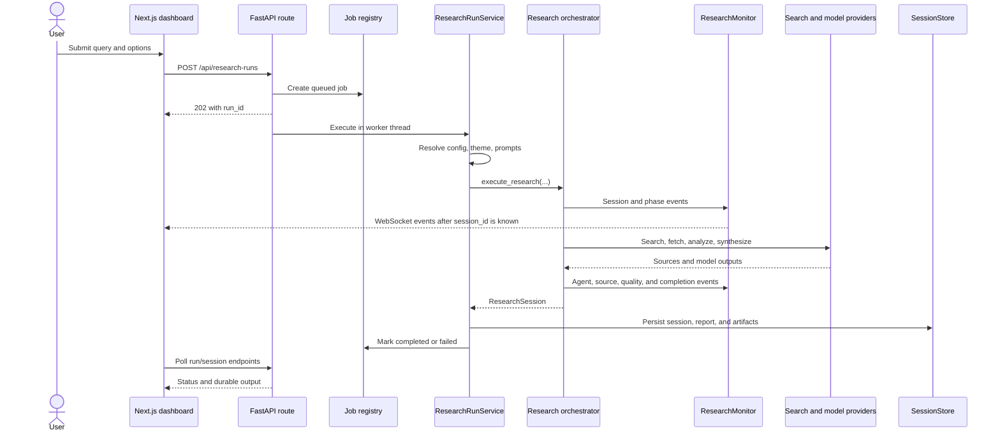

# Research Workflow Interactions

This trace describes what executes after an operator starts research from the
dashboard or `POST /api/research-runs`.

## End-to-end sequence

```mermaid
sequenceDiagram
    actor User
    participant UI as Next.js dashboard
    participant API as FastAPI route
    participant Jobs as Job registry
    participant Service as ResearchRunService
    participant Orch as Research orchestrator
    participant Monitor as ResearchMonitor
    participant Providers as Search and model providers
    participant Store as SessionStore

    User->>UI: Submit query and options
    UI->>API: POST /api/research-runs
    API->>Jobs: Create queued job
    API-->>UI: 202 with run_id
    API->>Service: Execute in worker thread
    Service->>Service: Resolve config, theme, prompts
    Service->>Orch: execute_research(...)
    Orch->>Monitor: Session and phase events
    Monitor-->>UI: WebSocket events after session_id is known
    Orch->>Providers: Search, fetch, analyze, synthesize
    Providers-->>Orch: Sources and model outputs
    Orch->>Monitor: Agent, source, quality, and completion events
    Orch-->>Service: ResearchSession
    Service->>Store: Persist session, report, and artifacts
    Service->>Jobs: Mark completed or failed
    UI->>API: Poll run/session endpoints
    API-->>UI: Status and durable output
```

## Interaction boundaries

### Dashboard and API

The browser submits typed run options but does not orchestrate agents. It polls
the run record until a `session_id` is available, then combines persisted
events with the live WebSocket stream.

### ResearchRunService

The service owns caller-independent setup:

- configuration and request overrides;
- theme detection and theme workflow adaptation;
- prompt registry construction;
- orchestrator selection;
- monitor finalization on success, failure, or cancellation;
- report and artifact materialization.

### Orchestrators and agents

The team and planner orchestrators own research policy and agent coordination.
They may schedule source discovery, extraction, analysis, synthesis, fact
checking, and quality work differently. All observable lifecycle changes flow
through `ResearchMonitor`.

### Providers

Search and model providers are adapters behind configured interfaces. Provider
credentials and errors remain backend concerns. A provider failure should be
represented in monitor/session state rather than leaked as browser-only state.

### Persistence and live delivery

Session files are durable. WebSocket delivery is transient. If the browser
disconnects, it reloads saved events and reconnects; it does not ask the
orchestrator to replay work.

## Failure and cancellation

| Condition | Expected behavior |
| --- | --- |
| Validation failure | API rejects the request before creating a job |
| Provider or orchestration error | job becomes `failed`; monitor is finalized as failed |
| Stop request | job records cancellation intent and the service checks it cooperatively |
| Browser disconnect | backend work continues and persisted events remain available |
| Backend restart | in-flight process-local jobs are lost; completed session data remains |

## Code map

- HTTP adapter: [`src/cc_deep_research/web_server_routes/research_run_routes.py`](../src/cc_deep_research/web_server_routes/research_run_routes.py)
- execution service: [`src/cc_deep_research/research_runs/service.py`](../src/cc_deep_research/research_runs/service.py)
- team orchestrator: [`src/cc_deep_research/orchestrator.py`](../src/cc_deep_research/orchestrator.py)
- planner orchestration: [`src/cc_deep_research/orchestration/`](../src/cc_deep_research/orchestration)
- monitor: [`src/cc_deep_research/monitoring.py`](../src/cc_deep_research/monitoring.py)
- persistence: [`src/cc_deep_research/session_store.py`](../src/cc_deep_research/session_store.py)
- live transport: [`src/cc_deep_research/event_router.py`](../src/cc_deep_research/event_router.py)
