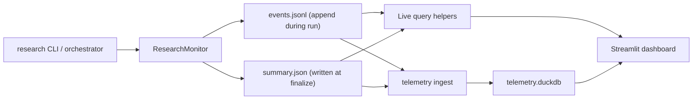

# Telemetry Architecture

This project uses a local, file-backed telemetry pipeline. It does not send runtime telemetry to a hosted observability service. Instead, the research workflow emits structured events into per-session JSONL files, optionally ingests completed sessions into DuckDB, and reads both sources from a Streamlit dashboard.

The core implementation lives in:

- [`src/cc_deep_research/monitoring.py`](../src/cc_deep_research/monitoring.py)
- [`src/cc_deep_research/telemetry.py`](../src/cc_deep_research/telemetry.py)
- [`src/cc_deep_research/dashboard_app.py`](../src/cc_deep_research/dashboard_app.py)
- [`src/cc_deep_research/cli.py`](../src/cc_deep_research/cli.py)
- [`src/cc_deep_research/orchestration/phases.py`](../src/cc_deep_research/orchestration/phases.py)

## End-to-End Flow



## Runtime Emission Model

`ResearchMonitor` is the central telemetry sink. Runtime code does not write telemetry files directly. Instead it calls typed helpers such as:

- `set_session()`
- `emit_event()`
- `record_search_query()`
- `record_tool_call()`
- `record_reasoning_summary()`
- `record_source_provenance()`
- `record_iteration_stop()`
- `finalize_session()`

Those helpers append normalized event payloads to an in-memory list and, when persistence is enabled, to disk.

### Important CLI Behavior

The top-level `research` command creates the monitor like this:

- `ResearchMonitor(enabled=(monitor or show_timeline) and not quiet)`

That means:

- `--monitor` controls console output only
- telemetry persistence is still on for normal CLI runs because `persist` defaults to `True`
- `--show-timeline` also enables monitor console output
- tests and direct code paths can disable persistence with `ResearchMonitor(..., persist=False)`

In practice, you do not need `--monitor` to get `events.jsonl` and `summary.json`. You only need it if you want live console logs in the terminal.

## Session Lifecycle

Each research run gets a session ID like `research-<12 hex chars>`.

Session setup happens in [`src/cc_deep_research/orchestration/execution.py`](../src/cc_deep_research/orchestration/execution.py):

1. `set_session()` initializes the session directory.
2. The monitor emits `session.started`.
3. The session event is pushed onto a parent stack.
4. Child events inherit that session event as their parent unless a more specific parent is active.
5. `finalize_session()` emits `session.finished` and writes `summary.json`.

### Correlation Fields

Every emitted event can carry:

- `event_id`: stable identifier for that event
- `parent_event_id`: parent in the event tree
- `sequence_number`: strictly increasing per session
- `timestamp`: UTC ISO-8601 timestamp

These fields power:

- ordered event tails
- hierarchical trees in the dashboard
- grouping of subprocess streams
- parent/child inspection helpers

## Phase Instrumentation

[`PhaseRunner`](../src/cc_deep_research/orchestration/phases.py) wraps major workflow phases and emits both lifecycle and duration records:

- `phase.started`
- `operation.started`
- `operation.finished`
- `phase.completed` or `phase.failed`

This is deliberate:

- `phase.*` records describe the phase lifecycle for humans and live views
- `operation.*` records carry duration timing in a generic format used by some analytics queries

When a phase starts, its `phase.started` event is pushed as the current parent. Any nested tool, agent, or reasoning events emitted during that phase automatically attach to it unless code overrides the parent explicitly.

## Where Events Come From

Telemetry is emitted throughout the workflow, not from a single analytics pass.

### Workflow and orchestration

- [`src/cc_deep_research/orchestration/execution.py`](../src/cc_deep_research/orchestration/execution.py): session start and finish
- [`src/cc_deep_research/orchestration/phases.py`](../src/cc_deep_research/orchestration/phases.py): phase lifecycle
- [`src/cc_deep_research/orchestration/planning.py`](../src/cc_deep_research/orchestration/planning.py): strategy summaries and query variation telemetry
- [`src/cc_deep_research/orchestration/source_collection.py`](../src/cc_deep_research/orchestration/source_collection.py): agent lifecycle, source provenance, content-fetch tool telemetry
- [`src/cc_deep_research/orchestration/analysis_workflow.py`](../src/cc_deep_research/orchestration/analysis_workflow.py): analysis-mode selection, follow-up decisions, iteration stop reasons

### Provider and tool execution

- [`src/cc_deep_research/agents/source_collector.py`](../src/cc_deep_research/agents/source_collector.py): provider search timing and result counts
- [`src/cc_deep_research/orchestration/source_collection.py`](../src/cc_deep_research/orchestration/source_collection.py): `mcp.web_reader` lifecycle and summarized `tool.call` records

### Claude CLI subprocess telemetry

Two code paths emit subprocess-style events:

- [`src/cc_deep_research/agents/llm_analysis_client.py`](../src/cc_deep_research/agents/llm_analysis_client.py)
- [`src/cc_deep_research/llm/claude_cli.py`](../src/cc_deep_research/llm/claude_cli.py)

These emit:

- `subprocess.scheduled`
- `subprocess.started`
- `subprocess.stdout_chunk`
- `subprocess.stderr_chunk`
- `subprocess.completed`
- `subprocess.failed`
- `subprocess.timeout`
- `subprocess.failed_to_start`

The dashboard groups those records into a single subprocess stream view using the scheduled event as the group root.

## Event Families

These are the main event families currently used by the codebase.

| Family | Event types | Purpose |
| --- | --- | --- |
| Session | `session.started`, `session.finished` | Marks run boundaries and embeds session-level summary data |
| Phase | `phase.started`, `phase.completed`, `phase.failed` | High-level workflow lifecycle |
| Timed operation | `operation.started`, `operation.finished` | Generic duration records, especially for phase timing |
| Agent | `agent.spawned`, `agent.started`, `agent.completed`, `agent.failed`, `agent.timeout`, `agent.event` | Tracks parallel researcher and agent activity |
| Search | `search.query` | Provider search query, status, result count, latency |
| Tool lifecycle | `tool.started`, `tool.completed`, `tool.failed` | Detailed lifecycle for tool-like actions such as content fetch |
| Tool summary | `tool.call` | Normalized summary record used in rollups and dashboard counts |
| Reasoning | `reasoning.summary`, `reflection.point` | Human-readable decision summaries |
| Planning and retrieval | `query.variations`, `source.provenance` | Query-family generation and which queries produced sources |
| Iteration | `analysis.mode_selected`, `follow_up.decision`, `iteration.stop` | Deep-analysis and iterative-search decisions |
| LLM usage | `llm.usage` | Token and latency summaries where token counts are available |
| Subprocess | `subprocess.*` | Claude CLI stream visibility and failure inspection |
| LLM route | `llm.route_selected`, `llm.route_fallback`, `llm.route_request`, `llm.route_completion` | Route-planning and route-usage analytics hooks |

### Dual records for tools and phases

Some operations intentionally generate more than one event:

- A tool can emit both `tool.started` / `tool.completed` and a summarized `tool.call`
- A phase can emit both `phase.*` and `operation.*`

This gives the dashboard both:

- fine-grained lifecycle detail
- stable rollup records for aggregate queries

## On-Disk Layout

By default telemetry lives under:

- `~/.config/cc-deep-research/telemetry/<session_id>/events.jsonl`
- `~/.config/cc-deep-research/telemetry/<session_id>/summary.json`

The default path is computed by [`get_default_telemetry_dir()`](../src/cc_deep_research/telemetry.py), which places telemetry next to the main config file.

### `events.jsonl`

This file is append-only during a run. Each line is one JSON object.

Canonical event fields:

| Field | Meaning |
| --- | --- |
| `event_id` | Unique event identifier |
| `parent_event_id` | Parent event, if any |
| `sequence_number` | Per-session ordering number |
| `timestamp` | UTC event timestamp |
| `session_id` | Session identifier |
| `event_type` | Stable telemetry type |
| `category` | Broad subsystem grouping such as `session`, `phase`, `agent`, `tool`, `llm` |
| `name` | Short operation name |
| `status` | Status label such as `started`, `completed`, `failed`, `timeout` |
| `duration_ms` | Optional duration |
| `agent_id` | Optional agent identifier |
| `metadata` | Structured event-specific payload |

Example:

```json
{
  "event_id": "78fd4d3c-570f-44d9-a6bf-607771f634ec",
  "parent_event_id": "2fb24ab3-4f5d-4df3-b4ee-dad7d13d1f7d",
  "sequence_number": 12,
  "timestamp": "2026-03-13T15:04:05.123456+00:00",
  "session_id": "research-a1b2c3d4e5f6",
  "event_type": "search.query",
  "category": "search",
  "name": "tavily",
  "status": "success",
  "duration_ms": 184,
  "agent_id": null,
  "metadata": {
    "query": "AI chip supply chain risks 2026",
    "result_count": 10
  }
}
```

### `summary.json`

`summary.json` is written only when `finalize_session()` runs. It contains session rollups such as:

- `status`
- `stop_reason`
- `total_sources`
- `providers`
- `total_time_ms`
- `instances_spawned`
- `search_queries`
- `tool_calls`
- `llm_prompt_tokens`
- `llm_completion_tokens`
- `llm_total_tokens`
- `llm_route`
- `event_count`
- `created_at`

Two details matter here:

- `session.finished.metadata` contains the same summary payload that is written to `summary.json`
- `created_at` is recorded at finalization time, not at initial session creation time

That second point is why historical views effectively sort completed sessions by summary-write time.

## Live Query Path

Live views read directly from the telemetry directory through helpers in [`src/cc_deep_research/telemetry.py`](../src/cc_deep_research/telemetry.py):

- `query_live_sessions()`
- `query_live_session_detail()`
- `query_live_event_tail()`
- `query_live_agent_timeline()`
- `query_live_event_tree()`
- `query_live_subprocess_streams()`
- `query_live_llm_route_analytics()`

Key behavior:

- active sessions are detected from the presence of `events.jsonl` without a finished summary
- live reads use a small file cache keyed by mtime and file size
- older events missing correlation fields are normalized on read with fallback IDs and sequence numbers
- `active_phase` is inferred by scanning for the last unmatched `phase.started`

The live path is what makes an in-flight session show up in the dashboard immediately, before DuckDB ingestion matters.

## Historical Analytics Path

Historical analytics are built by ingesting session files into DuckDB with:

- `cc-deep-research telemetry ingest`
- `cc-deep-research telemetry dashboard` (which performs an ingest before launch and on refresh)

### DuckDB tables

`ingest_telemetry_to_duckdb()` creates and refreshes:

- `telemetry_events`
- `telemetry_sessions`

`telemetry_events` stores normalized event rows plus `metadata_json`.

`telemetry_sessions` stores one row per completed session from `summary.json`.

Ingestion is session-replacement based:

- existing rows for a session are deleted first
- files are then re-read and re-inserted

That makes repeated ingest runs safe for incremental refreshes.

### Historical query helpers

Historical dashboard views use:

- `query_dashboard_data()`
- `query_session_detail()`
- `query_events_by_parent()`
- `query_event_tree()`
- `query_llm_route_analytics()`

One consequence of the split design:

- active sessions are visible through live file reads
- only completed sessions with `summary.json` appear in `telemetry_sessions`

## Dashboard Behavior

The operator dashboard is launched by:

```bash
cc-deep-research telemetry dashboard
```

The CLI command in [`src/cc_deep_research/cli.py`](../src/cc_deep_research/cli.py):

1. resolves the telemetry directory and DuckDB path
2. runs an ingest pass
3. launches Streamlit against [`src/cc_deep_research/dashboard_app.py`](../src/cc_deep_research/dashboard_app.py)

The Streamlit app then combines live and historical sources:

- live session overview and detail from JSON files
- KPI and trends from DuckDB

Main panes:

- Session Overview
- Live Operator View
- Recent Event Tail with filters
- Agent Timeline
- Event Tree
- Historical Trends
- Claude subprocess detail
- LLM route analytics
- JSON export for the selected live session

## LLM Telemetry: What Exists Today

The repository contains two different LLM-related telemetry layers.

### Active in the default research flow

These are actively produced by the current CLI workflow:

- `llm.usage` when a code path explicitly records usage
- `subprocess.*` events from Claude CLI-backed analysis paths

### Active route telemetry

The codebase also includes route-level telemetry support in:

- [`src/cc_deep_research/monitoring.py`](../src/cc_deep_research/monitoring.py)
- [`src/cc_deep_research/telemetry.py`](../src/cc_deep_research/telemetry.py)
- [`src/cc_deep_research/orchestration/session_state.py`](../src/cc_deep_research/orchestration/session_state.py)
- [`src/cc_deep_research/llm/`](../src/cc_deep_research/llm)

That infrastructure is designed to capture:

- planned route per agent
- actual transport/provider/model used
- fallback transitions
- per-route latency, token, and error summaries

The top-level orchestrator now wires route planning, the session-scoped registry, and the shared router into the default CLI path. In practice that means:

- planner-selected routes are emitted as `llm.route_selected`
- routed requests emit `llm.route_request`, `llm.route_completion`, and `llm.route_fallback`
- session metadata preserves both planned routes and actual route-usage summaries
- Claude CLI subprocess chunk events remain attached beneath the higher-level route request flow

The LLM Route Analytics pane should now populate during normal routed runs, with `heuristic` appearing when no external transport is available.

## Relationship to Session Persistence

Telemetry is not the same as the saved research session output.

- telemetry lives under the telemetry directory and stores observability data
- user-facing research sessions are stored separately by [`SessionStore`](../src/cc_deep_research/session_store.py)

That separation is intentional:

- telemetry answers "what happened during execution?"
- session persistence answers "what research result did we produce?"

## Optional Dependencies

Live file telemetry works with the base install.

DuckDB and dashboard features require the `dashboard` extra:

```bash
pip install "cc-deep-research[dashboard]"
```

That extra installs:

- `duckdb`
- `pandas`
- `streamlit`

## Adding New Telemetry

When you add telemetry to the project, follow the existing pattern.

1. Emit through `ResearchMonitor`, not by writing files directly.
2. Prefer a stable `event_type` and keep variable data inside `metadata`.
3. Reuse existing categories such as `phase`, `agent`, `tool`, `search`, `llm`, or `reasoning`.
4. Preserve parent/child correlation by emitting inside the active phase or by passing `parent_event_id`.
5. If the event should appear in analytics or dashboard views, update the corresponding query helper in [`src/cc_deep_research/telemetry.py`](../src/cc_deep_research/telemetry.py).
6. Add tests in [`tests/test_monitoring.py`](../tests/test_monitoring.py) or [`tests/test_telemetry.py`](../tests/test_telemetry.py).

Good candidates for the typed helper methods in `ResearchMonitor`:

- events that will be emitted from multiple call sites
- events whose metadata shape should stay stable over time
- events that need dedicated rollup logic during session finalization

## Known Limitations

- There is no top-level config flag to disable telemetry persistence for normal CLI research runs.
- Historical analytics only cover sessions that have a `summary.json`.
- `summary.json.created_at` reflects finalization time, not true session start time.
- CLI-backed routes still cannot report exact token counts from Claude subprocess output, so route summaries may show zero tokens for successful Claude CLI requests.
