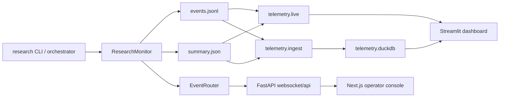

# Telemetry Architecture

This project uses a local, file-backed telemetry pipeline. Runtime telemetry is written into per-session JSONL files, optionally ingested into DuckDB for historical analytics, and consumed by two operator UIs:

- the Streamlit telemetry dashboard launched by `cc-deep-research telemetry dashboard`
- the FastAPI + Next.js real-time operator console launched with `cc-deep-research dashboard` plus the frontend in [`dashboard/`](../dashboard)

## Core Boundaries

The implementation is split across these modules:

- monitor emission and session finalization: [`src/cc_deep_research/monitoring.py`](../src/cc_deep_research/monitoring.py)
- telemetry compatibility exports: [`src/cc_deep_research/telemetry/__init__.py`](../src/cc_deep_research/telemetry/__init__.py)
- live JSONL readers: [`src/cc_deep_research/telemetry/live.py`](../src/cc_deep_research/telemetry/live.py)
- DuckDB ingestion: [`src/cc_deep_research/telemetry/ingest.py`](../src/cc_deep_research/telemetry/ingest.py)
- DuckDB analytics queries: [`src/cc_deep_research/telemetry/query.py`](../src/cc_deep_research/telemetry/query.py)
- telemetry CLI commands: [`src/cc_deep_research/cli/telemetry.py`](../src/cc_deep_research/cli/telemetry.py)
- real-time dashboard backend: [`src/cc_deep_research/cli/dashboard.py`](../src/cc_deep_research/cli/dashboard.py), [`src/cc_deep_research/web_server.py`](../src/cc_deep_research/web_server.py), and [`src/cc_deep_research/event_router.py`](../src/cc_deep_research/event_router.py)
- Streamlit dashboard app: [`src/cc_deep_research/dashboard_app.py`](../src/cc_deep_research/dashboard_app.py)
- Next.js operator console: [`dashboard/src/`](../dashboard/src)

## End-to-End Flow



## Runtime Emission Model

`ResearchMonitor` is the telemetry sink. Runtime code should emit through typed helpers such as:

- `set_session()`
- `emit_event()`
- `record_search_query()`
- `record_tool_call()`
- `record_reasoning_summary()`
- `record_source_provenance()`
- `record_iteration_stop()`
- `finalize_session()`

Those helpers keep telemetry writes normalized and let dashboards share one event contract.

### Decision Graph Derived Output

Session detail and trace-bundle exports now include a first-class `decision_graph` derived output alongside:

- `narrative`
- `critical_path`
- `state_changes`
- `decisions`
- `degradations`
- `failures`

The graph is built from existing telemetry, not a separate storage path. It currently creates node kinds for:

- explicit `decision.made` records
- explicit `state.changed` records
- explicit `degradation.detected` records
- failure/error events
- referenced cause events
- chosen and rejected decision outcomes

The graph currently emits:

- explicit `caused_by`, `produced`, and `rejected` edges directly from telemetry payloads
- inferred `produced` and `led_to` edges only when a narrow deterministic rule exists

The implementation intentionally favors correctness over graph density.

### Important CLI Behavior

The `research` command constructs the monitor with:

- `ResearchMonitor(enabled=(monitor or show_timeline) and not quiet)`

That means:

- `--monitor` controls terminal output, not persistence
- `events.jsonl` and `summary.json` are still written for normal CLI runs
- tests and direct code paths can disable persistence with `ResearchMonitor(..., persist=False)`

## Session Lifecycle

Each research run gets a session directory under the telemetry base dir:

- `~/.config/cc-deep-research/telemetry/<session_id>/events.jsonl`
- `~/.config/cc-deep-research/telemetry/<session_id>/summary.json`

The default telemetry path is computed by [`get_default_telemetry_dir()`](../src/cc_deep_research/telemetry/live.py) in [`src/cc_deep_research/telemetry/live.py`](../src/cc_deep_research/telemetry/live.py), which places telemetry next to the main config file.

Session setup and finalization happen in the orchestration runtime:

1. `set_session()` initializes the session directory.
2. The monitor emits `session.started`.
3. Phase, agent, tool, and subprocess events accumulate in `events.jsonl`.
4. `finalize_session()` emits `session.finished` and writes `summary.json`.

### Correlation Fields

Every emitted event can carry:

- `event_id`
- `parent_event_id`
- `sequence_number`
- `timestamp`

These fields support ordered tails, event trees, grouped subprocess streams, and parent/child inspection in dashboards.

## Phase Instrumentation

[`src/cc_deep_research/orchestration/phases.py`](../src/cc_deep_research/orchestration/phases.py) emits both lifecycle and timing records:

- `phase.started`
- `phase.completed`
- `phase.failed`
- `operation.started`
- `operation.finished`

Nested telemetry emitted during an active phase inherits that phase as its default parent.

## Event Families

These are the main event families currently used by the codebase.

| Family | Event types | Purpose |
| --- | --- | --- |
| Session | `session.started`, `session.finished` | Run boundaries and final rollups |
| Phase | `phase.started`, `phase.completed`, `phase.failed` | Workflow lifecycle |
| Timed operation | `operation.started`, `operation.finished` | Duration metrics |
| Agent | `agent.spawned`, `agent.started`, `agent.completed`, `agent.failed`, `agent.timeout`, `agent.event` | Parallel researcher and agent activity |
| Search | `search.query` | Provider search telemetry |
| Tool lifecycle | `tool.started`, `tool.completed`, `tool.failed` | Detailed tool-like lifecycle |
| Tool summary | `tool.call` | Stable rollup record for counts and summaries |
| Reasoning | `reasoning.summary`, `reflection.point` | Human-readable decisions |
| Planning and retrieval | `query.variations`, `source.provenance` | Query-family generation and source provenance |
| Iteration | `analysis.mode_selected`, `follow_up.decision`, `iteration.stop` | Follow-up and stop decisions |
| LLM usage | `llm.usage` | Token and latency summaries where available |
| Subprocess | `subprocess.*` | Generic external-process visibility and failures |
| LLM route | `llm.route_selected`, `llm.route_fallback`, `llm.route_request`, `llm.route_completion` | Route-planning and route-usage analytics |
| Decision graph inputs | `decision.made`, `state.changed`, `degradation.detected`, failure/error events | Explicit operator decisions and causal state transitions |

## Live Query Path

Live views read directly from session files through helpers in [`src/cc_deep_research/telemetry/live.py`](../src/cc_deep_research/telemetry/live.py):

- `query_live_sessions()`
- `query_live_session_detail()`
- `query_live_event_tail()`
- `query_live_agent_timeline()`
- `query_live_event_tree()`
- `query_live_subprocess_streams()`
- `query_live_llm_route_analytics()`

Key behavior:

- active sessions are detected from `events.jsonl` even before `summary.json` exists
- live reads are cached by file mtime and size
- older events missing correlation fields are normalized on read
- active phase is inferred from the last unmatched `phase.started`

This is what makes in-flight sessions appear immediately in both dashboards.

## Historical Analytics Path

Historical analytics are built by ingesting session files into DuckDB with:

- `cc-deep-research telemetry ingest`
- `cc-deep-research telemetry dashboard`

`ingest_telemetry_to_duckdb()` creates and refreshes:

- `telemetry_events`
- `telemetry_sessions`

Ingestion is session-replacement based, so repeated ingest runs are safe.

Historical dashboard views use helpers in [`src/cc_deep_research/telemetry/query.py`](../src/cc_deep_research/telemetry/query.py):

- `query_dashboard_data()`
- `query_session_detail()`
- `query_events_by_parent()`
- `query_event_tree()`
- `query_llm_route_analytics()`
- `query_llm_route_summary()`

## Dashboard Consumers

### Streamlit telemetry dashboard

The command:

```bash
cc-deep-research telemetry dashboard
```

does three things:

1. resolves the telemetry directory and DuckDB path
2. runs an ingest pass
3. launches Streamlit against [`src/cc_deep_research/dashboard_app.py`](../src/cc_deep_research/dashboard_app.py)

This dashboard combines:

- live session overview and detail from JSON files
- KPI and trends from DuckDB

### FastAPI + Next.js operator console

The command:

```bash
cc-deep-research dashboard --port 8000
```

starts the FastAPI backend that serves:

- `GET /api/sessions`
- `GET /api/sessions/{session_id}`
- `GET /api/sessions/{session_id}/events`
- `GET /ws/session/{session_id}`

The Next.js frontend in [`dashboard/`](../dashboard) consumes those endpoints for the browser-based operator console.

The browser detail response and portable trace bundle now also expose `decision_graph`.

## Decision Graph Limits

The decision graph is an observability surface, not authoritative truth beyond the telemetry emitted for a session.

Current limits:

- sparse graphs usually mean telemetry coverage is missing, not necessarily that no important decision happened
- inferred edges are intentionally conservative and are visually distinct in the dashboard
- route planning, iteration control, provider-availability changes, runtime fallbacks, and heuristic mitigations are covered explicitly, but not every orchestration branch is modeled yet
- same-timestamp proximity alone is not used to invent links across unrelated events

## Relationship to Session Persistence

Telemetry is separate from the saved research-session output.

- telemetry stores observability data under the telemetry directory
- user-facing session results are stored separately by [`src/cc_deep_research/session_store.py`](../src/cc_deep_research/session_store.py)

That separation lets the project answer both:

- "what happened during execution?"
- "what research result did we produce?"

## Optional Dependencies

Live telemetry files work with the base install.

The Streamlit dashboard requires the `dashboard` extra:

```bash
pip install "cc-deep-research[dashboard]"
```

That extra installs:

- `duckdb`
- `pandas`
- `streamlit`

The browser-based operator console also requires frontend dependencies under [`dashboard/`](../dashboard):

```bash
cd dashboard
npm install
npm run dev
```

## Adding New Telemetry

When adding telemetry:

1. Emit through `ResearchMonitor`, not by writing files directly.
2. Prefer stable `event_type` values and keep variable data inside `metadata`.
3. Reuse existing categories such as `phase`, `agent`, `tool`, `search`, `llm`, or `reasoning`.
4. Preserve parent/child correlation by emitting inside the active phase or by passing `parent_event_id`.
5. If the event should appear in dashboards or analytics, update the relevant helper in [`src/cc_deep_research/telemetry/live.py`](../src/cc_deep_research/telemetry/live.py), [`src/cc_deep_research/telemetry/query.py`](../src/cc_deep_research/telemetry/query.py), or the compatibility exports in [`src/cc_deep_research/telemetry/__init__.py`](../src/cc_deep_research/telemetry/__init__.py).
6. Add tests in [`tests/test_monitoring.py`](../tests/test_monitoring.py) or [`tests/test_telemetry.py`](../tests/test_telemetry.py).

## Known Limitations

- There is no top-level config flag to disable telemetry persistence for normal CLI runs.
- Historical analytics only cover sessions that have a `summary.json`.
- `summary.json.created_at` reflects finalization time, not true session start time.
- Some routed fallback paths may still report zero tokens when precise token accounting is unavailable.
