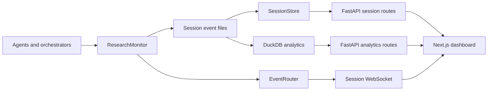

# Telemetry

Telemetry has two responsibilities:

1. persist a durable event trail for every research session;
2. feed live session events to the dashboard while a run is active.

The supported UI is the Next.js dashboard. Historical analysis is exposed
through FastAPI endpoints and DuckDB-backed readers; the old Streamlit
application and telemetry CLI are retired.

## Event flow


```mermaid
flowchart LR
    A["Agents and orchestrators"] --> B["ResearchMonitor"]
    B --> C["Session event files"]
    B --> D["EventRouter"]
    D --> E["Session WebSocket"]
    C --> F["SessionStore"]
    C --> G["DuckDB analytics"]
    F --> H["FastAPI session routes"]
    G --> I["FastAPI analytics routes"]
    H --> J["Next.js dashboard"]
    I --> J
    E --> J
```

The disk event stream is authoritative. Live routing is best-effort delivery
for the active browser view.

## Operator endpoints

| Purpose | Endpoint |
| --- | --- |
| List and filter sessions | `GET /api/sessions` |
| Session detail | `GET /api/sessions/{session_id}` |
| Events | `GET /api/sessions/{session_id}/events` |
| Report | `GET /api/sessions/{session_id}/report` |
| Artifacts and bundle | `GET /api/sessions/{session_id}/artifacts`, `/bundle` |
| Checkpoints | `GET /api/sessions/{session_id}/checkpoints` |
| Resume from executable checkpoint | `POST /api/sessions/{session_id}/resume` |
| Archive or restore | `POST /api/sessions/{session_id}/archive`, `/restore` |
| Add/read annotations | `POST` or `GET /api/sessions/{session_id}/annotations` |
| Live stream | `WS /ws/session/{session_id}` |
| Analytics summary | `GET /api/analytics` |

## Retention

Inspect retention before mutating data:

```bash
curl -sS http://127.0.0.1:8000/api/telemetry/retention
```

Compaction and policy application are explicit operations:

```bash
curl -sS -X POST http://127.0.0.1:8000/api/telemetry/retention/compact
curl -sS -X POST http://127.0.0.1:8000/api/telemetry/retention/apply
```

An archived session can be restored through
`POST /api/telemetry/retention/restore/{session_id}`. Back up the data paths
reported by `GET /api/operations/data-paths` before applying a destructive
retention policy.

## Development checks

Run the Python telemetry and monitoring tests:

```bash
uv run pytest \
  tests/test_monitoring.py \
  tests/test_session_store.py \
  tests/test_telemetry.py \
  tests/test_telemetry_query.py
```

Use `./scripts/preflight` before merging. The full suite also exercises
session APIs, WebSocket behavior, retention, and dashboard integration.

## Boundaries and caveats

- Event payloads are application records and may contain research text. Treat
  telemetry directories as sensitive data.
- The live router is not a durable queue and should not become one.
- DuckDB is an analysis layer over persisted events, not the write path.
- New event types must remain backward-compatible with saved sessions, or ship
  with an explicit migration and regression fixtures.
